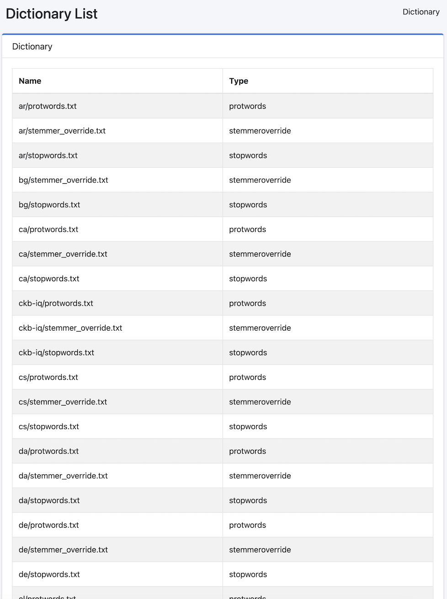

====
사전
====

개요
====

여기에서는 사전에 관한 설정에 대해 설명합니다.

사전 변경은 각 사전에 관한 사양을 이해한 후 실시하십시오.
사전 변경에 실패하면 인덱스에 액세스할 수 없게 될 수 있습니다.

목록
====

아래 그림의 관리 가능한 사전 목록 페이지를 열려면 왼쪽 메뉴의 [시스템 > 사전]을 클릭합니다.

|image0|

각 사전이 적용되는 범위와 반영 시점
====================================

사전마다 적용되는 필드와 반영되는 시점이 다릅니다.
사전을 편집했는데 검색 결과가 바뀌지 않는다면 먼저 이 표를 확인하십시오.

.. list-table::
   :header-rows: 1
   :widths: 22 26 28 24

   * - 사전
     - 파일
     - 적용되는 필드
     - 반영 시점
   * - Kuromoji
     - ``ja/kuromoji.txt``
     - ``content_ja`` 등 ``_ja`` 필드에만
     - 색인 시(재크롤링 필요)
   * - 동의어
     - ``synonym.txt``
     - ``content`` 및 ``title``
     - 검색 시(재크롤링 불필요)
   * - 매핑(언어 공통)
     - ``mapping.txt``
     - ``content`` 및 ``title``
     - 색인 시(재크롤링 필요)
   * - 매핑(언어별)
     - ``ja/mapping.txt``
     - ``content_ja`` 등 ``_ja`` 필드에만
     - 색인 시(재크롤링 필요)
   * - Protwords
     - ``en/protwords.txt``
     - ``content`` 및 ``title``
     - 색인 시와 검색 시
   * - 불용어
     - ``en/stopwords.txt``
     - ``content`` 및 ``title``
     - 색인 시와 검색 시
   * - Stemmer 덮어쓰기
     - ``en/stemmer_override.txt``
     - ``content`` 및 ``title``
     - 색인 시와 검색 시

.. note::

   분석기는 인덱스를 열 때 구성되므로 사전 파일을 갱신해도
   **인덱스를 close / open 하기 전까지는 반영되지 않습니다**.
   또한 색인 시에 적용되는 사전은 이미 색인된 문서에 소급 적용되지 않으므로
   해당 문서를 다시 크롤링해야 합니다.

.. warning::

   대부분의 검색에 응답하는 ``content`` 필드에 적용되는 문자 치환 사전은
   **루트의** ``mapping.txt`` 이며 ``ja/mapping.txt`` 가 아닙니다.
   이름은 같은 매핑이지만 서로 다른 파일입니다.

Kuromoji 사용자 사전과 검색 결과
---------------------------------

``content`` 필드는 standard 토크나이저와 ``cjk_bigram`` 으로 분석되므로
Kuromoji의 형태소 분할 결과에 영향을 받지 않습니다. 일본어 복합어를 Kuromoji
사용자 사전에 등록하고 다시 크롤링해도 ``content`` 에 대한 검색 결과는 바뀌지
않습니다. 등록의 효과는 ``content_ja`` 에 나타나며, 이 필드는 요청 언어에 따라
검색 조건에 추가됩니다.

Kuromoji
========

일본어 형태소 분석용 사전을 관리합니다.
ja/kuromoji.txt는 일본어 형태소 분석용 사전입니다.

동의어
=====

동의어 사전을 관리합니다.
synonym.txt는 언어 공통으로 사용되는 동의어 사전 파일입니다.

매핑
========

문자 치환 사전을 관리합니다.
mapping.txt는 언어 공통 또는 각 언어용 단어 치환 사전 파일입니다.

Protwords
=========

보호 단어 사전을 관리합니다.
protwords.txt는 각 언어용으로 배치하여 스테밍 대상 제외 등을 위한 단어 목록 파일입니다.

불용어
===========

불용어 사전을 관리합니다.
stopwords.txt는 각 언어용으로 배치하여 인덱스 생성 시 제외할 단어 목록 파일입니다.

Stemmer 재정의
============

Stemmer 재정의 사전을 관리합니다.
stemmer_override.txt는 각 언어용으로 배치하여 스테밍 처리를 재정의하기 위한 단어 치환 사전 파일입니다.

