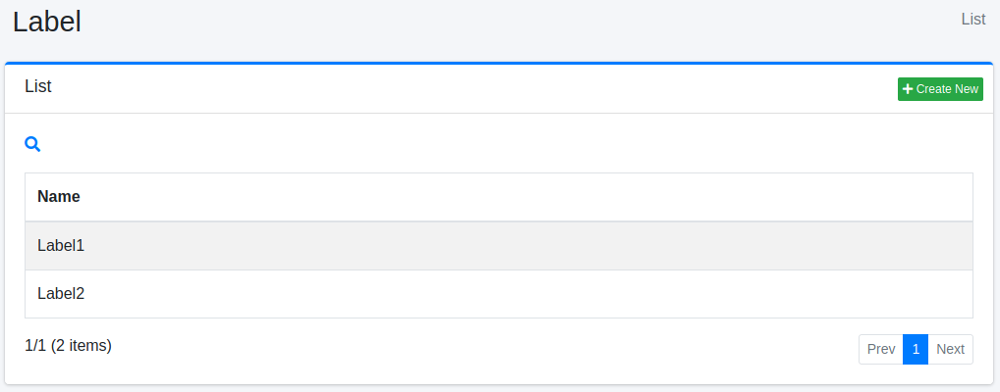
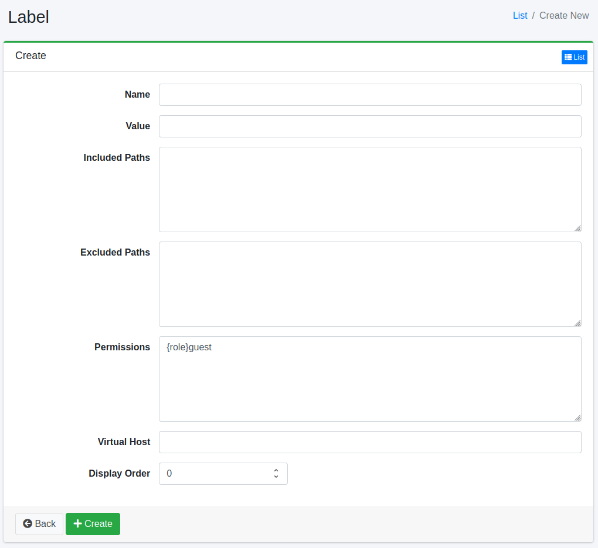

=====
라벨
=====

개요
====

여기서는 라벨에 관한 설정에 대해 설명합니다.
라벨은 검색 결과에 표시되는 문서를 분류할 수 있습니다.
라벨 설정은 라벨을 추가할 경로를 정규 표현식으로 지정합니다.
라벨을 등록한 경우 검색 옵션 내에 라벨 드롭다운 상자가 표시됩니다.

여기서의 라벨 설정은 웹 또는 파일 시스템의 크롤링 설정에 적용됩니다.

관리 방법
======

표시 방법
------

아래 그림의 라벨 설정 목록 페이지를 열려면 왼쪽 메뉴의 [크롤러 > 라벨]을 클릭합니다.

|image0|

편집하려면 설정 이름을 클릭합니다.

설정 생성
--------

라벨 설정 페이지를 열려면 신규 생성 버튼을 클릭합니다.

|image1|

설정 항목
------

이름
::::

검색 시 라벨 선택 드롭다운 상자에 표시되는 이름을 지정합니다.

값
::

문서를 분류할 때의 식별자를 지정합니다.
영숫자로 지정하십시오.

대상 경로
:::::::::::

라벨을 추가할 경로를 정규 표현식으로 설정합니다.
여러 줄로 기술하여 여러 개를 지정할 수 있습니다.
여기서 지정한 경로와 일치하는 문서에 라벨이 설정됩니다.

제외할 경로
:::::::::

크롤링 대상 경로 중 제외하려는 경로를 정규 표현식으로 설정합니다.
여러 줄로 기술하여 여러 개를 지정할 수 있습니다.

권한
:::::::::::

이 설정의 권한을 지정합니다.
권한 지정 방법은 예를 들어, developer 그룹에 속한 사용자에게 검색 결과를 표시하려면 {group}developer로 지정합니다.
사용자 단위 지정은 {user}사용자명, 역할 단위 지정은 {role}역할명, 그룹 단위 지정은 {group}그룹명으로 지정합니다.

가상 호스트
::::::::

가상 호스트의 호스트명을 지정합니다.
자세한 내용은 :doc:`설정 가이드의 가상 호스트 <../config/security-virtual-host>` 를 참조하십시오.

가상 호스트로 접근한 검색 화면에는 이 항목에 그 가상 호스트 이름을 지정한 라벨만 표시됩니다.
이 항목이 비어 있는 라벨은 가상 호스트로 접근했을 때 표시되지 않습니다.
어느 가상 호스트에도 일치하지 않는 접근에서는 이 항목과 관계없이 모든 라벨이 표시됩니다.

하나의 라벨에 지정할 수 있는 가상 호스트는 하나입니다.
여러 가상 호스트에서 같은 라벨을 표시하려면 이름과 값이 같은 라벨을 가상 호스트별로 작성하고, 각각의 가상 호스트 항목에 그 가상 호스트 이름을 지정합니다.
값이 같으면 어느 라벨을 선택해도 같은 문서로 좁혀집니다.

표시 순서
::::::

라벨의 표시 순서를 지정합니다.

종류
::::

「라벨」 또는 「태그」를 지정합니다. 일반 라벨은 「라벨」입니다. 「태그」는 사용자가 검색 화면에서 추가하는 태그입니다(아래의 「태그」를 참조). 종류를 지정하지 않은 기존 라벨은 「라벨」로 취급됩니다.

설정 삭제
--------

목록 페이지의 설정 이름을 클릭하고 삭제 버튼을 클릭하면 확인 화면이 표시됩니다.
삭제 버튼을 누르면 설정이 삭제됩니다.

태그
----

``fess_config.properties`` 에서 ``user.tag.enabled=true`` (기본값: ``false`` )로 설정하면 로그인한 사용자가 검색 결과에 태그를 붙일 수 있습니다. 기본 제공 ``bootstrap`` 테마에서는 결과에 태그가 표시되고, 태그 추가와 자신이 붙인 태그의 삭제가 가능하며, 「태그」 패싯으로 결과를 좁힐 수 있습니다. API 에 대해서는 :doc:`../api/api-tag` 를 참조하십시오.

태그는 종류가 「태그」인 라벨로 저장됩니다. 이름이 태그 이름, 값이 태그 이름의 SHA-256, 대상 경로가 태그를 붙인 URL(한 줄에 하나, 정확히 일치), 권한이 태그를 볼 수 있는 사용자입니다. 태그를 붙인 사용자는 권한에 추가됩니다.

- 태그는 그 라벨의 권한이 호출자와 일치하는 경우에만 보입니다. 관리자는 이 화면에서 태그를 편집하여 역할이나 그룹과 공유하거나 삭제할 수 있습니다.
- 같은 이름의 태그는 하나의 라벨로 합쳐집니다. 따라서 같은 이름의 태그를 붙인 사용자끼리는 서로의 태그가 붙은 곳을 볼 수 있습니다.
- 태그는 라벨 목록 API( ``/api/v2/labels`` )나 검색 화면의 라벨 선택지에 포함되지 않습니다.
- 태그는 라벨 건수 상한( ``page.labeltype.max.fetch.size`` , 기본값: 1000)에 포함됩니다. 상한에 도달하면 새 태그를 만들 수 없습니다.
- 관리자가 이 화면에서 태그를 변경 또는 삭제한 후, 인덱스의 문서는 다시 크롤링하거나 「Label Updater」 작업을 실행할 때까지 이전 값을 유지합니다.
- 문서 하나에 붙일 수 있는 태그 수는 ``user.tag.max.document.tags`` (기본값: 100), 태그 이름의 길이는 ``user.tag.name.max.length`` (기본값: 50)자까지입니다.

