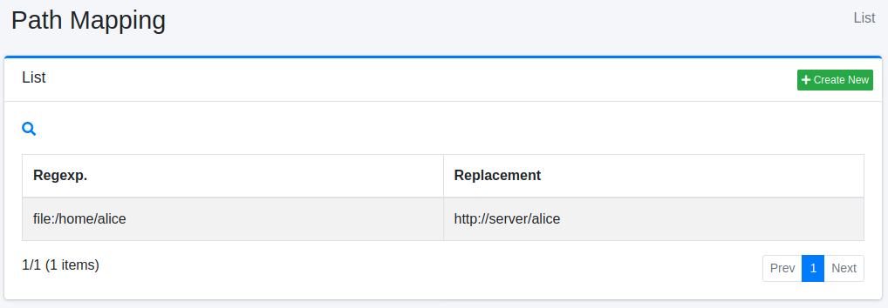
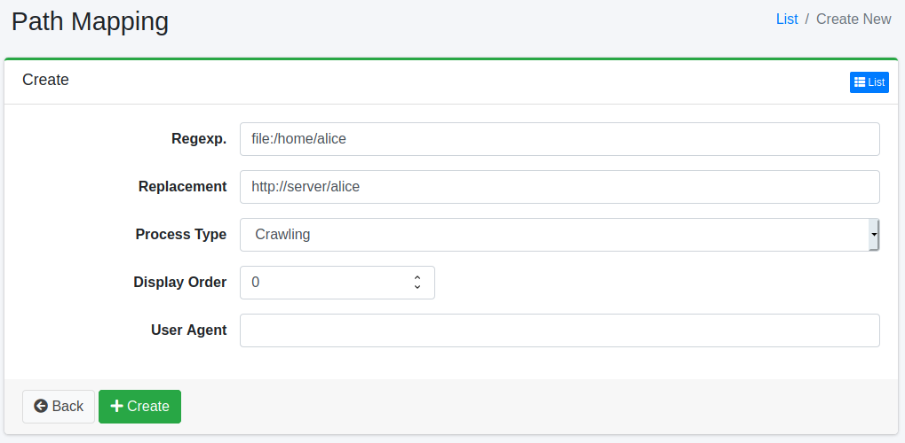

===========
경로 매핑
===========

개요
====

여기서는 경로 매핑에 관한 설정에 대해 설명합니다.
경로 매핑은 검색 결과에 표시할 링크를 바꾸고 싶은 경우 등에 사용할 수 있습니다.

관리 방법
======

표시 방법
------

아래 그림의 경로 매핑 설정 목록 페이지를 열려면 왼쪽 메뉴의 [크롤러 > 경로 매핑]을 클릭합니다.

|image0|

편집하려면 설정 이름을 클릭합니다.

설정 생성
--------

경로 매핑 설정 페이지를 열려면 신규 생성 버튼을 클릭합니다.

|image1|

설정 항목
------

정규 표현식
::::::

치환하려는 문자열을 지정합니다.
기술 방법은 Java의 정규 표현식을 따릅니다.

치환
::::

일치한 정규 표현식을 치환할 문자열을 지정합니다.

치환 문자열이 ``(엔진명):`` 형식으로 시작하는 경우, 콜론 앞부분이 실행할 스크립트 엔진의 이름으로 해석되며, 등록된 엔진명과 일치하면 콜론 이후의 문자열이 해당 엔진의 스크립트로 평가됩니다.
예를 들어 ``groovy:`` 는 Groovy 엔진(``fess-script-groovy`` 플러그인 필요)을 선택하고, ``javascript:`` (별칭 ``js:``, ``sai:``)는 JavaScript 엔진을 선택합니다.
콜론 앞부분이 등록된 스크립트 엔진명과 일치하지 않는 경우(예: 일반 치환 문자열에서 콜론 앞이 ``https`` 처럼 URL 스킴명인 경우)에는 스크립트로 취급되지 않고, 문자열 전체가 그대로 정규 표현식의 치환 문자열로 사용됩니다.
스크립트로 평가되는 경우, 그 스크립트 내에서는 변환 대상 URL 문자열을 나타내는 ``url`` 과, 정규 표현식의 ``java.util.regex.Matcher`` 를 나타내는 ``matcher`` 를 사용할 수 있습니다.

::

    javascript:url.replace(/http:\/\//g, "https://")

처리 종류
::::::::

치환 시점을 지정합니다.

* 크롤링: 크롤링 시 문서 획득 후 인덱싱하기 전에 URL을 치환합니다.
* 표시: 검색 시 표시하기 전에 URL을 치환합니다.
* 크롤링/표시: 크롤링과 표시 모두에서 URL을 치환합니다.
* 추출된 URL 변환: 크롤링 시 문서 획득 전에 URL을 치환합니다.

표시 순서
::::::

경로 매핑의 처리 순서를 지정할 수 있습니다.
오름차순으로 처리됩니다.

설정 삭제
--------

목록 페이지의 설정 이름을 클릭하고 삭제 버튼을 클릭하면 확인 화면이 표시됩니다.
삭제 버튼을 누르면 설정이 삭제됩니다.

