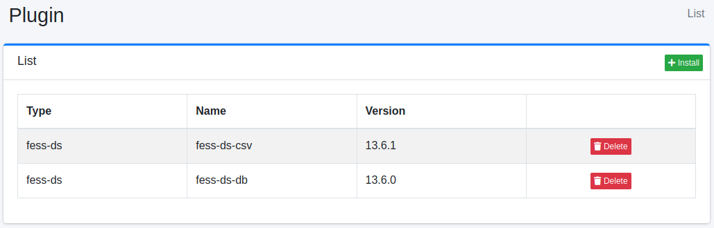
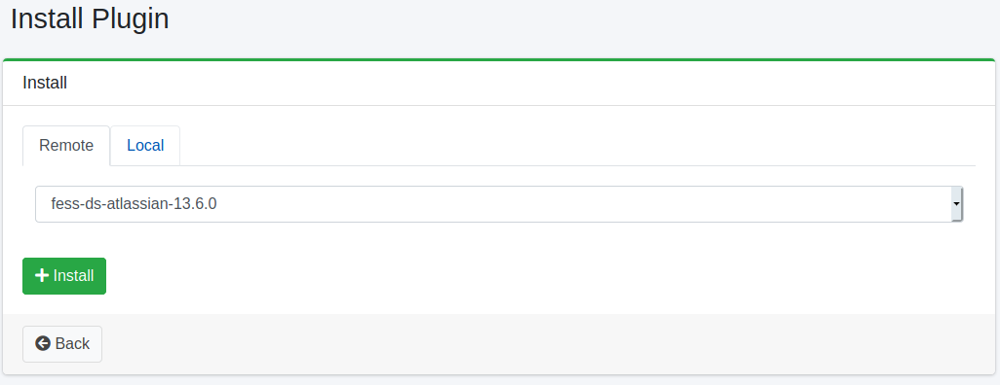

========
플러그인
========

개요
====

플러그인 설정 페이지에서 플러그인을 관리합니다.

관리 방법
======

표시 방법
------

아래 그림의 설치된 플러그인 목록 페이지를 열려면 왼쪽 메뉴의 [시스템 > 플러그인]을 클릭합니다.

|image0|

제거하려면 삭제 버튼을 클릭합니다.

설치
---------

새로운 플러그인을 설치하려면 설치 버튼을 클릭합니다.

|image1|

풀다운 메뉴에서 설치할 플러그인을 선택하고 설치 버튼을 클릭하면 설치가 시작됩니다.

명령줄에서 설치
===============

``bin/fess-setup`` 을 사용하면 명령줄에서 플러그인을 설치할 수 있습니다.

::

    $ bin/fess-setup install plugin fess-script-groovy

버전을 지정하지 않으면 이 |Fess| 에 맞는 최신 버전이 저장소에서 선택되므로 실행할 때마다 다른 버전이 설치될 수 있습니다. 버전을 고정하려면 플러그인 이름 뒤에 콜론으로 구분하여 버전을 지정합니다.

::

    $ bin/fess-setup install plugin fess-script-groovy:15.9.0 fess-ds-git:15.9.0

플러그인은 각각 개별적으로 릴리스되므로 함께 설치하는 플러그인의 버전이 반드시 같지는 않습니다. 플러그인마다 지정하십시오. 버전을 지정하지 않은 플러그인에는 ``--version`` 의 값이 사용됩니다.

::

    $ bin/fess-setup install plugin fess-script-groovy fess-ds-git:15.9.1 --version 15.9.0

새 버전의 설치가 완료된 후에 같은 플러그인의 이전 버전이 삭제됩니다. 존재하지 않는 버전을 지정하면 종료 코드 1로 종료되므로, Dockerfile 등의 빌드 단계에 포함하더라도 플러그인이 빠진 채로 진행되지 않습니다.

