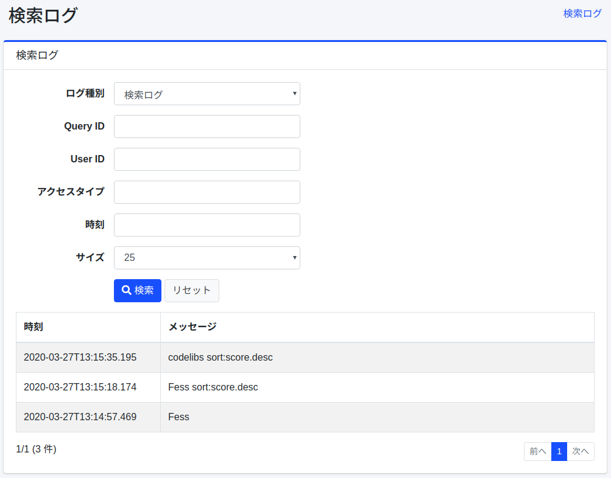
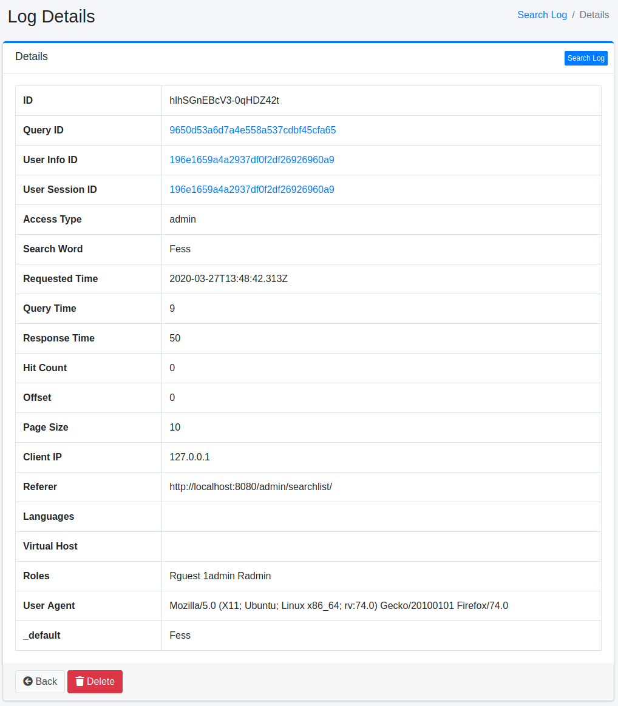

=========
검색 로그
=========

개요
====

검색, 클릭, 즐겨찾기의 실행 결과는 기록됩니다. 검색 로그 화면에서는 이를 집계한 분석 리포트와 개별 로그 목록을 확인할 수 있습니다.

화면을 열려면 왼쪽 메뉴의 [시스템 정보 > 검색 로그] 를 클릭합니다. 처음에는 「개요」 탭이 표시됩니다.
열람하려면 ``admin-searchlog`` 또는 ``admin-searchlog-view`` 역할이 필요합니다. ``admin-searchlog-view`` 로는 로그를 삭제할 수 없습니다.

분석 리포트
===========

기간과 필터
-----------

각 탭 상단에서 집계할 기간을 「오늘」「어제」「최근 7일」「최근 28일」「최근 90일」 중에서 고르거나, 「사용자 지정」으로 시작일과 종료일(최대 366일)을 지정합니다.
「이전 기간과 비교」를 활성화하면 같은 일수만큼 앞선 기간의 값과 비교합니다. 접근 유형과 표의 행 수도 지정할 수 있습니다.
기간과 그래프의 구간은 서버 시간대의 날짜를 따릅니다.

탭
--

- **개요**: 검색 수, 사용자 수, 제로 히트율, 클릭률, 평균 응답 시간 지표를 작은 추이 그래프 및 이전 기간 대비 변화와 함께 표시합니다. 지표를 전환할 수 있는 추이 그래프(비교 시 이전 기간을 점선으로 표시)와 인기 검색어, 제로 히트 검색어도 표시합니다.
- **검색어**: 검색어별 검색 수, 사용자 수, 평균 히트 수, 클릭 수, 클릭률, 평균 클릭 순위를 표시합니다. 제로 히트 검색어(최종 검색 일시 포함)와, 히트했지만 결과가 한 번도 클릭되지 않은 제로 클릭 검색어도 표시합니다.
- **클릭**: 클릭 수가 많은 URL, 즐겨찾기 수가 많은 URL, 클릭 순위 분포, 2페이지 이후 열람률을 표시합니다.
- **성능**: 응답 시간의 평균과 중앙값(p50)・p95・p99, 응답 시간 분포, 응답이 느린 검색어, 쿼리 시간을 표시합니다.
- **사용자·환경**: 신규 사용자와 기존 사용자, 접근 유형, 요일・시간대별 검색 수, 상위 User-Agent, 리퍼러, 언어, 가상 호스트를 표시합니다. 「역할·그룹별 검색 수」는 역할과 그룹별 검색 수, 사용자 수, 제로 히트율을 표시합니다. 검색은 실행한 사용자의 모든 역할과 그룹에 집계되므로 합계가 전체 검색 수보다 많아질 수 있습니다. 개별 사용자는 표시되지 않습니다.
- **AI 채팅**: AI 검색 모드(RAG 채팅)의 요청 수, 사용자 수, 총 토큰 수, 평균 응답 시간, 오류율과 상위 사용자, 의도별・모델별 요청을 표시합니다. 채팅 이용 로그는 ``rag.chat.log.enabled`` (기본값: ``true`` )가 활성화된 경우에 기록됩니다. 질문과 답변 내용은 기록되지 않습니다. 토큰 수는 LLM 플러그인이 보고한 경우에만 기록됩니다.
- **로그**: 개별 로그 목록입니다. 아래의 「로그 목록」을 참조하십시오.

.. note::

   검색어별 클릭 지표와 제로 클릭 검색어는 클릭과 함께 검색어가 기록되게 된 이후( |Fess| 15.9 이후)의 클릭만 집계합니다. 전체 클릭 수와 클릭률에는 그 이전의 클릭도 포함됩니다. 사용자 수 등 일부 값은 근사치입니다.

제로 히트 검색어 확인
---------------------

「개요」와 「검색어」 탭에서 제로 히트 검색어를 클릭하면, 「로그」 탭에 히트 수 「0건만」으로 필터링한 그 검색어의 검색 로그가 표시됩니다. 어떤 검색에서 결과를 찾지 못했는지 확인하고 문서, 동의어, 관련 쿼리 추가에 활용할 수 있습니다.

CSV 다운로드
------------

분석 리포트의 각 표와 그래프에는 CSV 링크가 있어, 현재 기간, 비교, 접근 유형, 행 수 조건으로 집계한 내용을 다운로드할 수 있습니다. 필터 영역에는 지표를 정리한 CSV 링크도 있습니다.
숫자는 가공하지 않고 출력됩니다(비율은 0〜1, 시간은 밀리초). 비교 시의 그래프에는 ``<series>_previous`` 열이 추가됩니다.

로그 목록
=========

「로그」 탭에서는 검색 로그, 클릭 로그, 즐겨찾기 로그, 사용자 로그를 확인할 수 있습니다.
로그 유형, 쿼리 ID, 사용자 ID, 시간 범위, 접근 유형, 검색어로 필터링할 수 있으며, 검색 로그는 히트 수(「모두」「0건만」「1건 이상」)로도 필터링할 수 있습니다.
로그의 세부 정보를 확인하려면 대상 로그를 클릭합니다.

|image0|

[CSV 다운로드] 버튼을 클릭하면 현재 조건에 일치하는 로그를 건수 제한 없이 최신순으로 CSV 로 다운로드할 수 있습니다. 머리글 행은 필드 이름이며 화면 언어에 따라 바뀌지 않습니다.

CSV 파일은 분석 리포트의 것을 포함해 ``csv.file.encoding`` 의 문자 코드로 출력되며, UTF-8 의 경우 BOM 이 붙습니다. ``=`` , ``+`` , ``-`` , ``@`` , 탭, 캐리지 리턴으로 시작하는 값에는 스프레드시트에서 수식으로 처리되지 않도록 앞에 ``'`` 가 붙습니다.

세부 정보
---------

목록에서 로그를 클릭하면 대상 로그의 세부 정보가 표시됩니다.

|image1|

