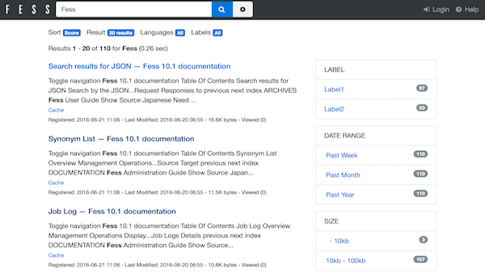

======
사용법
======

이 페이지에서는 Fess의 기본적인 사용법에 대해 설명합니다.
Fess를 설치하지 않은 경우 :doc:`setup` 또는 :doc:`quick-start` 를 참조하세요.

Fess의 UI에 대하여
===================

Fess는 다음 UI를 제공합니다.

-  브라우저에 의한 검색·검색 결과 UI(일반 사용자용)
-  브라우저에 의한 관리 UI(관리자용)

검색 화면(일반 사용자용)
===========================

검색 화면 접속
------------------

일반 사용자가 Fess에 의해 검색 대상이 된 문서를 검색하는 UI입니다.

http://localhost:8080/ 에 접속하면 검색어 입력란과 검색 버튼이 표시됩니다.

기본 검색
----------

검색할 단어를 입력하고 검색 버튼을 클릭하면 검색 결과가 표시됩니다.

|브라우저에 의한 검색 결과 표시|

검색 결과에는 다음 정보가 표시됩니다:

- 제목
- URL
- 본문 발췌(검색 키워드가 하이라이트 표시됨)
- 최종 업데이트 날짜
- 파일 크기(문서의 경우)

고급 검색
--------

**AND 검색**

여러 키워드를 공백으로 구분하여 입력하면 모든 키워드를 포함하는 문서가 검색됩니다.

예: ``Fess 검색`` → "Fess"와 "검색" 모두를 포함하는 문서

**OR 검색**

키워드 사이에 ``OR`` 를 입력하면 어느 하나의 키워드를 포함하는 문서가 검색됩니다.

예: ``Fess OR Elasticsearch`` → "Fess" 또는 "Elasticsearch"를 포함하는 문서

**NOT 검색**

제외하고 싶은 키워드 앞에 ``-`` 를 붙이면 그 키워드를 포함하지 않는 문서가 검색됩니다.

예: ``Fess -Elasticsearch`` → "Fess"를 포함하지만 "Elasticsearch"를 포함하지 않는 문서

**프레이즈 검색**

키워드를 ``""`` 로 묶으면 그 프레이즈를 완전 일치로 검색합니다.

예: ``"전문 검색"`` → "전문 검색"이라는 단어를 포함하는 문서

검색 옵션
------------

검색 화면에는 다음 옵션을 사용할 수 있습니다:

- **라벨 검색**: 특정 라벨이 부여된 문서만 검색
- **기간 지정**: 특정 기간에 업데이트된 문서만 검색
- **파일 형식 지정**: 특정 파일 형식(PDF, Word 등)만 검색

관리 화면(관리자용)
====================

관리 화면 접속
------------------

관리자가 Fess를 관리하기 위한 UI입니다.

http://localhost:8080/admin/ 에 접속하면 로그인 화면이 표시됩니다.

기본 관리자 계정:

- **사용자명**: ``admin``
- **비밀번호**: ``admin``

.. warning::

   **보안에 관한 중요한 주의**

   기본 비밀번호는 반드시 변경하세요.
   특히 프로덕션 환경에서는 첫 로그인 후 즉시 비밀번호를 변경할 것을 강력히 권장합니다.

.. note::

   관리 UI는 Responsive Web Design에 대응하지 않습니다.
   PC 브라우저에서의 접속을 권장합니다.

주요 관리 기능
----------

로그인하면 다음 설정·관리 기능에 접속할 수 있습니다:

**크롤러 설정**

- 웹 크롤 설정
- 파일 시스템 크롤 설정
- 데이터 스토어 크롤 설정

**시스템 설정**

- 일반 설정(타임존, 메일 설정 등)
- 사용자·역할 관리
- 스케줄러 설정
- 디자인 설정

**검색 설정**

- 라벨 관리
- 키워드 관련도 조정
- 동의어·사전 관리

자세한 관리 방법은 사용자 가이드를 참조하세요.

다음 단계
==========

기본 사용법을 이해했다면 다음 문서를 참조하여 더 자세히 배울 수 있습니다:

- **사용자 가이드**: 크롤 설정, 검색 설정 상세
- **API 문서**: REST API를 사용한 검색 통합
- **개발자 가이드**: 커스터마이즈 및 확장 기능 개발

