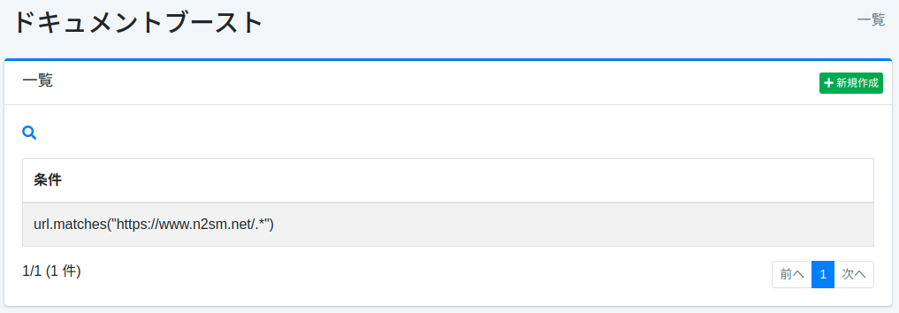

===============
文档提升
===============

概述
====

本节介绍文档提升的相关配置。
通过配置文档提升,可以将文档置于搜索结果的上方,而不受搜索词的影响。

管理方法
======

显示方法
------

要打开下图所示的文档提升配置列表页面,请点击左侧菜单中的 [爬虫 > 文档提升]。

|image0|

点击配置名称进行编辑。

创建配置
--------

要打开文档提升配置页面,请点击新建按钮。

|image1|

配置项
------

条件
::::

指定要置于上方的文档的条件。
例如,如果要将包含 https://www.n2sm.net/ 的 URL 显示在上方,请写入 url.matches("https://www.n2sm.net/.*")。
条件可以使用 Groovy 编写。

提升值表达式
:::::::::

指定文档权重的值。
表达式可以使用 Groovy 编写。

排序顺序
::::::

设置文档提升的排序顺序。

删除配置
--------

点击列表页面中的配置名称,然后点击删除按钮,将显示确认画面。点击删除按钮将删除配置。

.. |image1| image:: ../../../resources/images/ja/15.3/admin/boostdoc-2.png
