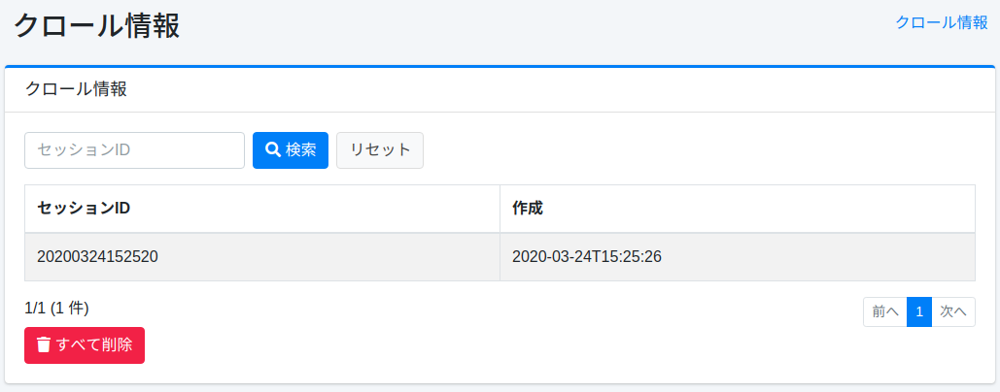

=========
爬虫信息
=========

概述
====

爬虫的执行结果会被记录，爬虫信息可以在此管理界面中查看。

管理方法
======

列表
====

每次执行爬虫时都会记录为爬虫信息。
在列表中可以查看已执行爬虫的会话名称和执行时间。
如果要查看爬虫信息的详细内容，请点击目标爬虫信息。

|image0|

详情
====

从列表中点击爬虫信息的会话ID后，将显示目标爬虫信息的详细内容。

|image1|

项目列表
------

会话ID
::::::::::

爬虫执行时的会话ID。

爬虫开始时间
:::::::::::::::

爬虫整体开始的时间。

爬虫开始时间（Web/文件）
::::::::::::::::::::::::::::

Web和文件系统爬虫开始的时间。

爬虫开始时间（数据存储）
::::::::::::::::::::::::::

数据存储爬虫开始的时间。

爬虫结束时间（Web/文件）
::::::::::::::::::::::::::::

Web和文件系统爬虫结束的时间。

爬虫执行时间（数据存储）
::::::::::::::::::::::::::

数据存储爬虫的执行时间（毫秒）。

索引执行时间（数据存储）
::::::::::::::::::::::::::::::

索引Web和文件系统爬虫结果所需的时间（毫秒）。

索引大小（数据存储）
:::::::::::::::::::::::::::

已索引文档的数量。

爬虫结束时间（数据存储）
::::::::::::::::::::::::::

数据存储爬虫结束的时间。

爬虫状态
::::::::::::

爬虫是否成功。

爬虫结束时间
:::::::::::::::

爬虫整体结束的时间。

爬虫执行时间
:::::::::::::::

爬虫整体的执行时间（毫秒）。

.. |image1| image:: ../../../resources/images/ja/15.3/admin/crawlinginfo-2.png
