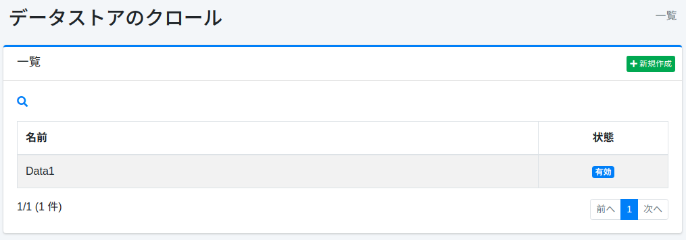
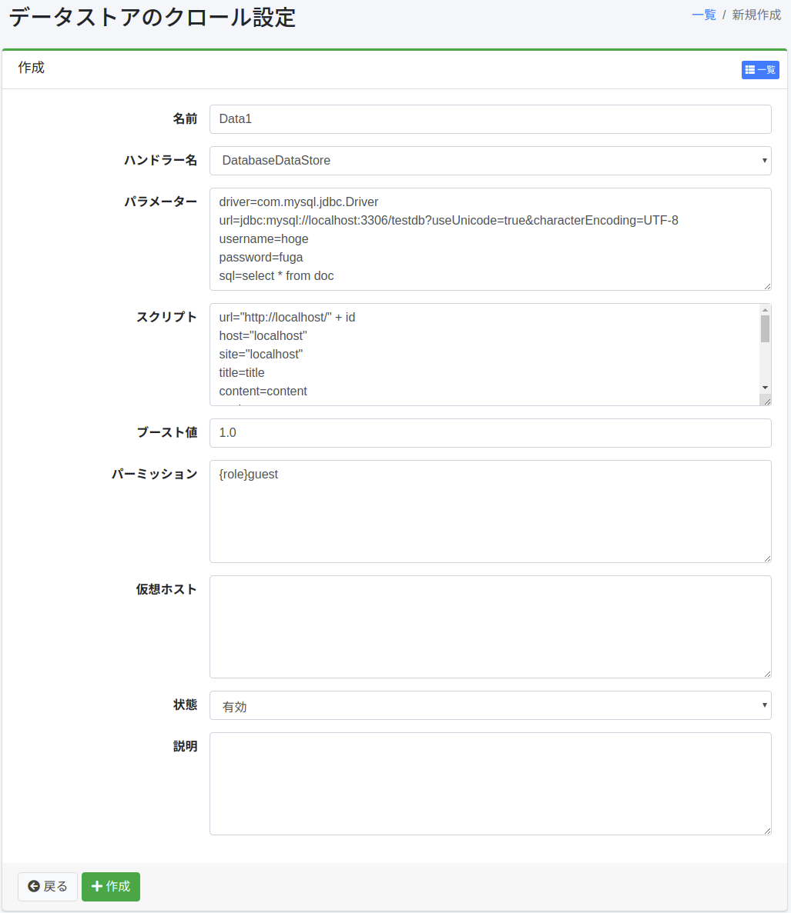

===============
数据存储爬取
===============

概述
====

|Fess| 可以将数据库和CSV等数据源作为爬取对象。
本文档将说明配置数据存储所需的设置。

管理方法
======

显示方法
------

要打开下图所示的数据存储配置列表页面,请点击左侧菜单中的 [爬虫 > 数据存储]。

|image0|

点击配置名称即可进行编辑。

创建配置
--------

点击新建按钮打开数据存储配置页面。

|image1|

配置项
------

名称
::::

指定爬取配置的名称。

处理器名称
:::::::::

处理数据存储的处理器名称。

* DatabaseDataStore: 爬取数据库
* CsvDataStore: 以CSV/TSV文件为对象进行爬取
* CsvListDataStore: 爬取包含索引目标文件路径的CSV文件

参数
:::::::::

指定与数据存储相关的参数。

脚本
::::::::

指定如何将从数据存储获取的值设置到哪些字段。
表达式可以使用Groovy编写。

权重值
::::::::

指定使用此配置爬取的文档的权重值。

权限
:::::::::::

指定此配置的权限。
权限的指定方法,例如,要向属于developer组的用户显示搜索结果,需要指定{group}developer。
用户级别的指定为{user}用户名,角色级别的指定为{role}角色名,组级别的指定为{group}组名。

虚拟主机
::::::::

指定虚拟主机的主机名。
详情请参考 :doc:`配置指南的虚拟主机 <../config/virtual-host>`。

状态
::::

指定是否使用此爬取配置。

说明
::::

可以输入说明。

删除配置
--------

在列表页面点击配置名称,然后点击删除按钮将显示确认界面。
按下删除按钮后配置将被删除。

示例
==

DatabaseDataStore
-----------------

说明数据库爬取。

例如,假设MySQL的testdb数据库中有以下表,可以使用用户名hoge、密码fuga进行连接。

::

    CREATE TABLE doc (
        id BIGINT NOT NULL AUTO_INCREMENT,
        title VARCHAR(100) NOT NULL,
        content VARCHAR(255) NOT NULL,
        latitude VARCHAR(20),
        longitude VARCHAR(20),
        versionNo INTEGER NOT NULL,
        PRIMARY KEY (id)
    );

这里预先插入以下数据。

::

    INSERT INTO doc (title, content, latitude, longitude, versionNo) VALUES ('タイトル 1', 'コンテンツ 1 です．', '37.77493', ' -122.419416', 1);
    INSERT INTO doc (title, content, latitude, longitude, versionNo) VALUES ('タイトル 2', 'コンテンツ 2 です．', '34.701909', '135.494977', 1);
    INSERT INTO doc (title, content, latitude, longitude, versionNo) VALUES ('タイトル 3', 'コンテンツ 3 です．', '-33.868901', '151.207091', 1);
    INSERT INTO doc (title, content, latitude, longitude, versionNo) VALUES ('タイトル 4', 'コンテンツ 4 です．', '51.500152', '-0.113736', 1);
    INSERT INTO doc (title, content, latitude, longitude, versionNo) VALUES ('タイトル 5', 'コンテンツ 5 です．', '35.681137', '139.766084', 1);

参数
::::::::::::

参数配置示例如下。

::

    driver=com.mysql.jdbc.Driver
    url=jdbc:mysql://localhost:3306/testdb?useUnicode=true&characterEncoding=UTF-8
    username=hoge
    password=fuga
    sql=select * from doc

参数采用"键=值"格式。键的说明如下。

.. tabularcolumns:: |p{4cm}|p{8cm}|
.. list-table::

   * - driver
     - 驱动程序类名
   * - url
     - URL
   * - username
     - 连接数据库时的用户名
   * - password
     - 连接数据库时的密码
   * - sql
     - 用于获取爬取对象的SQL语句

表: 数据库配置参数示例

脚本
::::::::

脚本配置示例如下。

::

    url="http://SERVERNAME/" + id
    host="SERVERNAME"
    site="SERVERNAME"
    title=title
    content=content
    cache=content
    digest=content
    anchor=
    content_length=content.length()
    last_modified=new java.util.Date()
    location=latitude + "," + longitude
    latitude=latitude
    longitude=longitude

参数采用"键=值"格式。键的说明如下。

值的部分使用Groovy编写。
字符串请用双引号括起来。通过数据库列名访问即可获取其值。

.. tabularcolumns:: |p{4cm}|p{8cm}|
.. list-table::

   * - url
     - URL(请根据您的环境设置可访问数据的URL)
   * - host
     - 主机名
   * - site
     - 站点路径
   * - title
     - 标题
   * - content
     - 文档内容(索引目标字符串)
   * - cache
     - 文档缓存(不作为索引目标)
   * - digest
     - 搜索结果中显示的摘要部分
   * - anchor
     - 文档中包含的链接(通常不需要指定)
   * - content_length
     - 文档长度
   * - last_modified
     - 文档最后修改日期

表: 脚本配置内容

驱动程序
::::::::

连接数据库时需要驱动程序。请将jar文件放置在app/WEB-INF/lib目录下。

CsvDataStore
------------

说明以CSV文件为对象的爬取。

例如,在/home/taro/csv目录中创建test.csv文件,内容如下。
文件编码设置为Shift_JIS。

::

    1,タイトル 1,テスト1です。
    2,タイトル 2,テスト2です。
    3,タイトル 3,テスト3です。
    4,タイトル 4,テスト4です。
    5,タイトル 5,テスト5です。
    6,タイトル 6,テスト6です。
    7,タイトル 7,テスト7です。
    8,タイトル 8,テスト8です。
    9,タイトル 9,テスト9です。

参数
:::::::::

参数配置示例如下。

::

    directories=/home/taro/csv
    fileEncoding=Shift_JIS

参数采用"键=值"格式。键的说明如下。

.. tabularcolumns:: |p{4cm}|p{8cm}|
.. list-table::

   * - directories
     - 包含CSV文件的目录(.csv或.tsv)
   * - files
     - CSV文件(直接指定时)
   * - fileEncoding
     - CSV文件编码
   * - separatorCharacter
     - 分隔符

表: CSV文件配置参数示例

脚本
::::::::

脚本配置示例如下。

::

    url="http://SERVERNAME/" + cell1
    host="SERVERNAME"
    site="SERVERNAME"
    title=cell2
    content=cell3
    cache=cell3
    digest=cell3
    anchor=
    content_length=cell3.length()
    last_modified=new java.util.Date()

参数采用"键=值"格式。
键与数据库爬取的情况相同。
CSV文件中的数据保存在cell[数字]中(数字从1开始)。
如果CSV文件的单元格中不存在数据,可能会为null。

EsDataStore
-----------

数据获取源为elasticsearch,但基本使用方法与CsvDataStore相同。

参数
:::::::::

参数配置示例如下。

::

    settings.cluster.name=elasticsearch
    hosts=SERVERNAME:9300
    index=logindex
    type=data

参数采用"键=值"格式。键的说明如下。

.. tabularcolumns:: |p{4cm}|p{8cm}|
.. list-table::

   * - settings.*
     - elasticsearch的Settings信息
   * - hosts
     - 连接目标elasticsearch
   * - index
     - 索引名称
   * - type
     - 类型名称
   * - query
     - 获取条件的查询

表: elasticsearch配置参数示例

脚本
::::::::

脚本配置示例如下。

::

    url=source.url
    host="SERVERNAME"
    site="SERVERNAME"
    title=source.title
    content=source.content
    digest=
    anchor=
    content_length=source.size
    last_modified=new java.util.Date()

参数采用"键=值"格式。
键与数据库爬取的情况相同。
可以通过source.*获取值并进行设置。

CsvListDataStore
----------------

用于爬取大量文件。
将已更新文件的路径写入CSV文件并放置,通过仅爬取指定的路径,可以缩短爬取的执行时间。

描述路径时的格式如下。

::

    [操作]<分隔符>[路径]

操作指定以下之一:

* create: 文件已创建
* modify: 文件已更新
* delete: 文件已删除

例如,在/home/taro/csv目录中创建test.csv文件,内容如下。
文件编码设置为Shift_JIS。

路径的描述方式与在文件爬取中指定爬取目标路径时相同。
如下所示,指定为"file:/[路径]"或"smb://[路径]"的形式。

::

    modify,smb://servername/data/testfile1.txt
    modify,smb://servername/data/testfile2.txt
    modify,smb://servername/data/testfile3.txt
    modify,smb://servername/data/testfile4.txt
    modify,smb://servername/data/testfile5.txt
    modify,smb://servername/data/testfile6.txt
    modify,smb://servername/data/testfile7.txt
    modify,smb://servername/data/testfile8.txt
    modify,smb://servername/data/testfile9.txt
    modify,smb://servername/data/testfile10.txt

参数
:::::::::

参数配置示例如下。

::

    directories=/home/taro/csv
    fileEncoding=Shift_JIS

参数采用"键=值"格式。键的说明如下。

.. tabularcolumns:: |p{4cm}|p{8cm}|
.. list-table::

   * - directories
     - 包含CSV文件的目录(.csv或.tsv)
   * - fileEncoding
     - CSV文件编码
   * - separatorCharacter
     - 分隔符

表: CSV文件配置参数示例

脚本
::::::::

脚本配置示例如下。

::

    event_type=cell1
    url=cell2

参数采用"键=值"格式。
键与数据库爬取的情况相同。

如果爬取目标需要身份验证,还需要设置以下内容。

::

    crawler.file.auth=example
    crawler.file.auth.example.scheme=SAMBA
    crawler.file.auth.example.username=username
    crawler.file.auth.example.password=password

