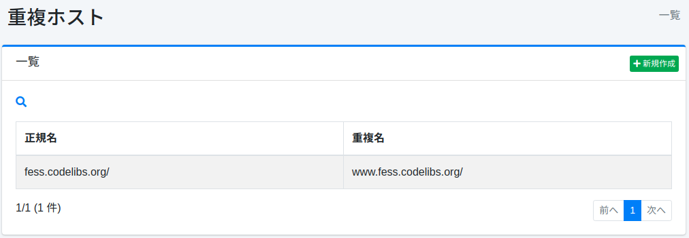

========
重复主机
========

概述
====

本节介绍有关重复主机的配置。
重复主机用于在爬取时将不同的主机名视为相同主机。
例如，在希望将 www.example.com 和 example.com 视为同一站点的情况下可以使用。

管理方法
======

显示方法
------

要打开下图所示的重复主机设置列表页面，请点击左侧菜单中的 [爬虫 > 重复主机]。

|image0|

点击设置名称可进行编辑。

创建设置
--------

要打开重复主机设置页面，请点击新建按钮。

|image1|

配置项
------

正规名
:::::

指定正规主机名。重复主机名将替换为正规主机名。

重复名
:::::

指定重复的主机名。指定要替换的主机名。

删除设置
--------

点击列表页面的设置名称，然后点击删除按钮，将显示确认画面。
点击删除按钮将删除该设置。

.. |image1| image:: ../../../resources/images/ja/15.3/admin/duplicatehost-2.png
