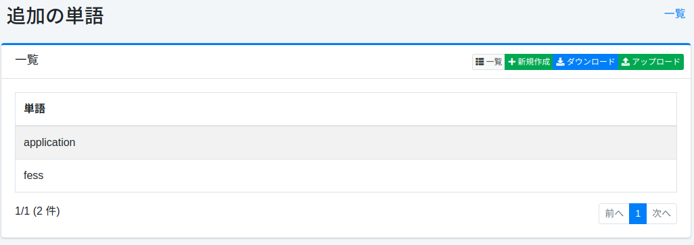
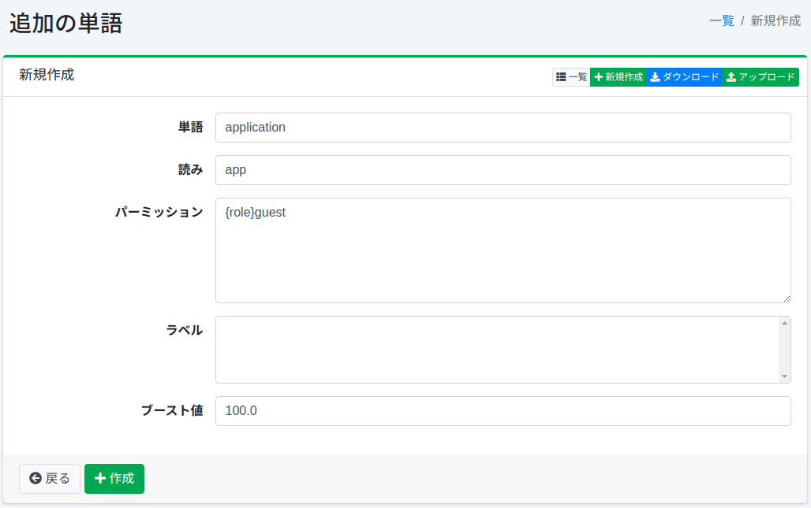
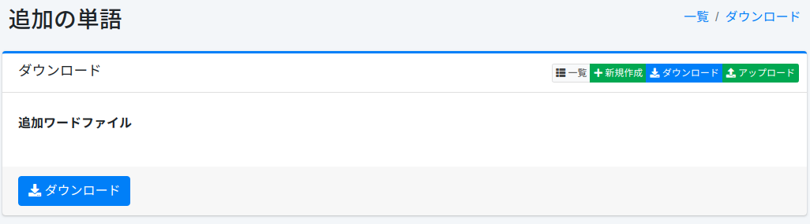
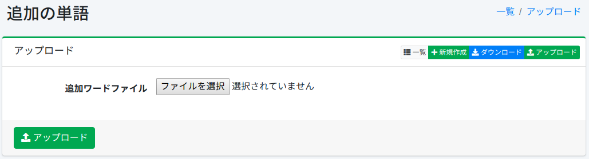

========
追加词汇
========

概述
====

本节介绍如何配置建议词汇的附加候选项。建议会根据搜索词显示，您可以添加更多词汇。

管理方法
======

显示方法
------

要打开下图所示的追加词汇配置列表页面，请点击左侧菜单中的 [建议 > 追加词汇]。

|image0|

要编辑配置，请点击配置名称。

创建配置
--------

要打开追加词汇配置页面，请点击新建按钮。

|image1|

配置项目
------

单词
::::

指定要显示为建议候选项的词汇。

读音
::::

指定建议候选词汇的读音。

权限
:::::::::::

为词汇设置角色信息。
只有具有配置角色的用户才能在建议中看到该词汇。

标签
:::::

为词汇设置标签。
如果选择了配置标签以外的标签，该词汇将不会显示在建议中。

提升值
::::::::

为词汇设置提升值。

删除配置
--------

点击列表页面中的配置名称，然后点击删除按钮将显示确认屏幕。
点击删除按钮后，配置将被删除。

下载
=========

以CSV格式下载已注册的词汇。

|image2|

CSV内容
--------

第1行是标题行。
第2行及以后记录追加词汇。

::

"SuggestWord","Reading","Role","Label","Boost"
"fess","ふぇす","role1","label1","100"

上传
=========

以CSV格式注册词汇。

|image3|

CSV内容
--------

第1行是标题行。
第2行及以后描述追加词汇。

::

"SuggestWord","Reading","Role","Label","Boost"
"fess","ふぇす","role1","label1","100"

