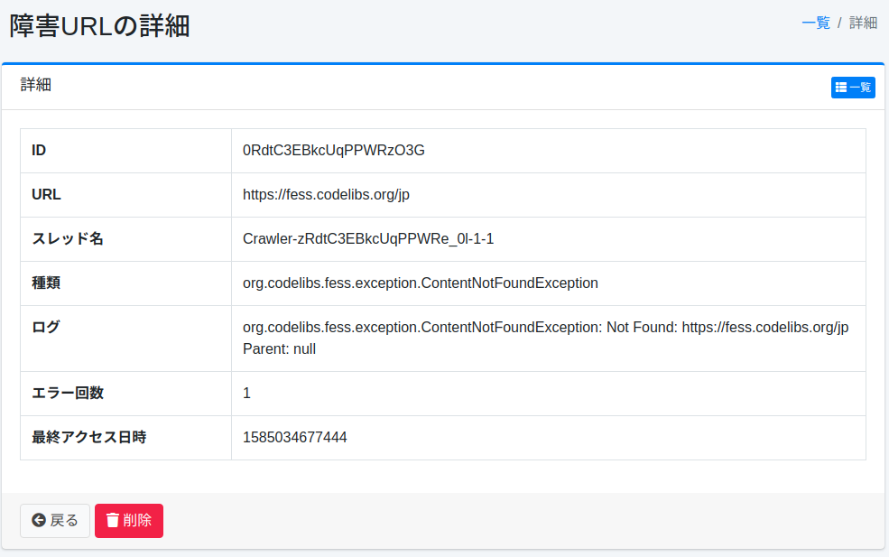

======
故障URL
======

概述
====

本节介绍故障URL。
爬虫时无法获取的URL会被记录，可以作为故障URL查看。

管理方法
======

显示方法
------

要打开用于查看故障URL的列表页面，请点击左侧菜单中的 [系统信息 > 故障URL]。

|image0|

点击故障URL的查看链接将显示详细信息。

故障URL详情
===========

故障URL详情中记录了爬虫时发生的异常。

|image1|

详情内容
--------

URL
::::

发生异常的URL。

线程名
::::::::

执行爬虫的线程名称。
可在查看日志文件时使用。

类型
::::

异常的类型。

日志
::::

异常的内容。

错误次数
::::::::

此异常发生的次数。

最后访问时间
::::::::::::

此异常发生的时间。

.. |image0| image:: ../../../resources/images/ja/15.3/admin/failureurl-1.png

