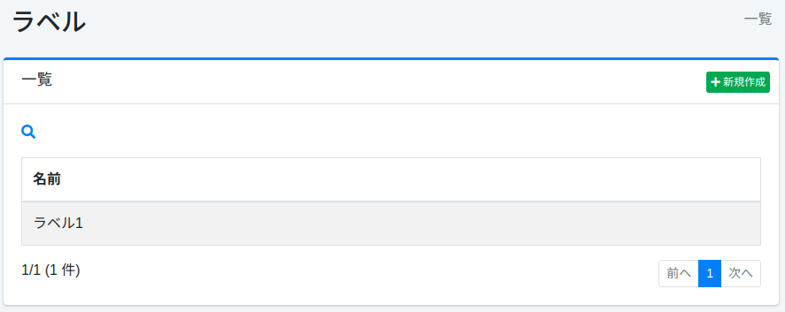
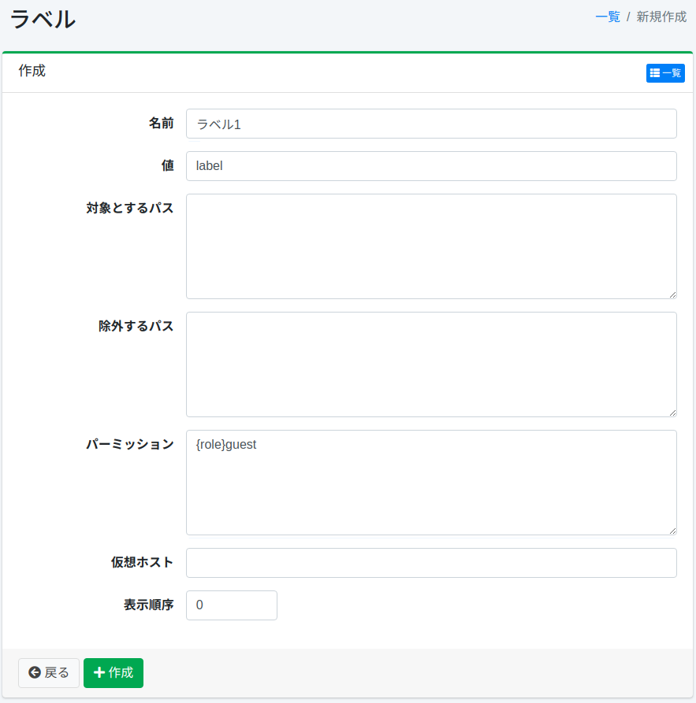

=====
标签
=====

概述
====

本节介绍标签的相关配置。
标签可以对搜索结果中显示的文档进行分类。
标签配置通过正则表达式指定添加标签的路径。
如果注册了标签,搜索选项中将显示标签下拉框。

此处的标签设置适用于 Web 或文件系统的爬虫配置。

管理方法
======

显示方法
------

要打开下图所示的标签配置列表页面,请点击左侧菜单中的 [爬虫 > 标签]。

|image0|

点击配置名称进行编辑。

创建配置
--------

要打开标签配置页面,请点击新建按钮。

|image1|

配置项
------

名称
::::

指定在搜索时标签选择下拉框中显示的名称。

值
::

指定文档分类时的标识符。
请使用字母和数字指定。

目标路径
:::::::::::

使用正则表达式设置添加标签的路径。
可以通过多行描述来指定多个路径。
与此处指定路径匹配的文档将被设置标签。

排除路径
:::::::::

使用正则表达式设置要从爬虫目标路径中排除的路径。
可以通过多行描述来指定多个路径。

权限
:::::::::::

指定此配置的权限。
例如,要使搜索结果仅显示给属于 developer 组的用户,请指定 {group}developer。
按用户指定为 {user}用户名,按角色指定为 {role}角色名,按组指定为 {group}组名。

虚拟主机
::::::::

指定虚拟主机的主机名。
详细信息请参阅 :doc:`配置指南的虚拟主机 <../config/virtual-host>`。

显示顺序
::::::

指定标签的显示顺序。

删除配置
--------

点击列表页面中的配置名称,然后点击删除按钮,将显示确认画面。
点击删除按钮将删除配置。

