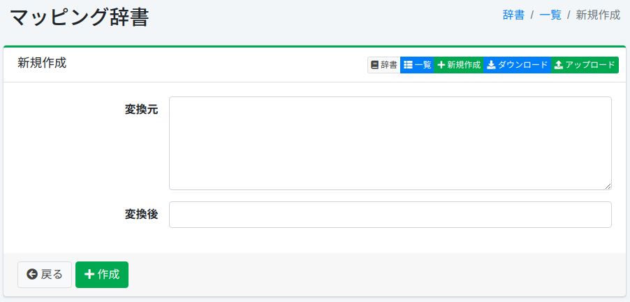

===========
映射词典
===========

概述
====

可以将特定字符(符号、字符编码、全角半角)映射到其他字符。

管理方法
======

显示方法
------

要打开下图所示的映射配置列表页面,请在左侧菜单中选择[系统 > 词典],然后单击 mapping。

|image0|

单击配置名称进行编辑。

配置方法
------

要打开映射配置页面,请单击"新建"按钮。

|image1|

配置项
------

转换前
:::::

输入要映射的目标字符(符号、字符编码、全角半角)。

转换后
:::::

将转换前输入的字符用转换后的字符展开。

下载
=========

可以按映射词典格式下载。

上传
=========

可以按映射词典格式上传。

.. |image0| image:: ../../../resources/images/ja/15.3/admin/mapping-1.png

