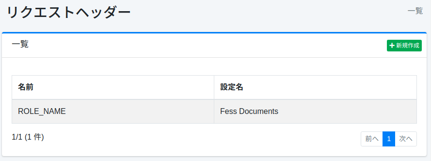
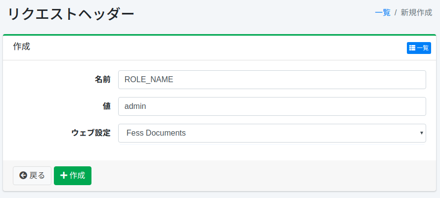

==============
请求头
==============

概述
====

本节介绍有关请求头的配置。
请求头功能用于在爬取文档时向请求添加的请求头信息。
例如，如果认证系统检查头信息，当存在特定值时自动登录，可以在这种情况下使用。

管理方法
======

显示方法
------

要打开下图所示的请求头设置列表页面，请点击左侧菜单中的 [爬虫 > 请求头]。

|image0|

点击设置名称可进行编辑。

创建设置
--------

要打开请求头设置页面，请点击新建按钮。

|image1|

配置项
------

名称
::::

指定添加到请求时的请求头名称。

值
::

指定添加到请求时的请求头值。

Web 设置
::::::::

选择要添加请求头的 Web 爬取设置名称。
仅在选定的爬取设置中添加到请求头。

删除设置
--------

点击列表页面的设置名称，然后点击删除按钮，将显示确认画面。
点击删除按钮将删除该设置。

