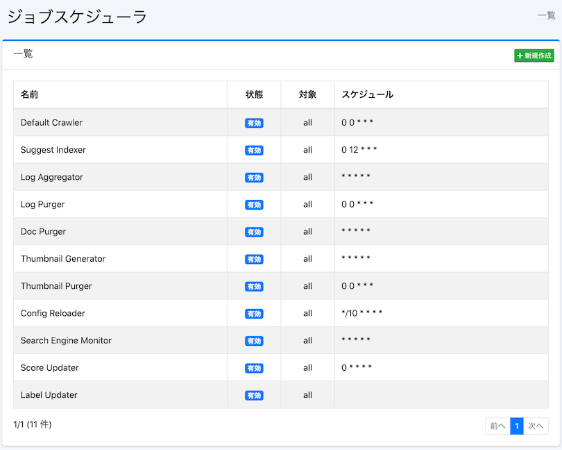
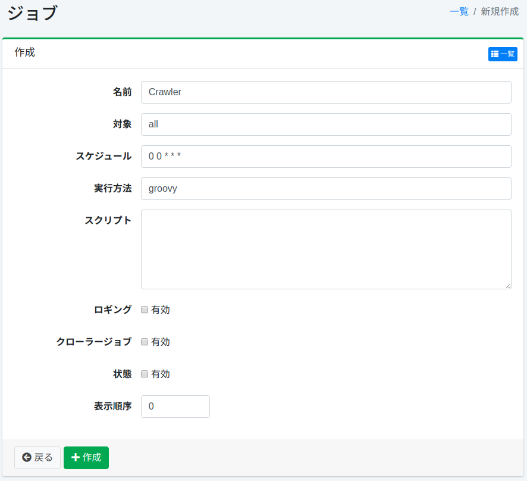

=========
调度器
=========

概述
====

本节介绍作业调度器的相关配置。

管理方法
======

显示方法
------

要打开下图所示的作业调度器配置列表页面,请单击左侧菜单中的[系统 > 调度器]。

|image0|

单击配置名称进行编辑。

创建配置
--------

要打开调度器配置页面,请单击"新建"按钮。

|image1|

配置项
------

名称
::::

在列表中显示的名称。

目标
::::

目标可用作直接通过批处理等命令执行作业时的执行标识符。
如果不通过命令执行爬取,请指定"all"。

计划
:::::::::

进行计划配置。
在此处配置的计划中,将执行脚本中描述的作业。

描述格式为 CRON 格式,格式为"分 时 日 月 星期"。
例如,"0 12 \* \* 3"表示在每周三的 12:00 PM 执行作业。

执行方法
::::::

指定脚本的执行环境。
目前仅支持"groovy"。

脚本
::::::::

用执行方法中指定的语言描述作业的执行内容。

例如,如果要仅执行 3 个爬取配置作为爬取作业,请按如下方式描述(假设 Web 爬取配置的 ID 为 1 和 2,文件系统爬取配置的 ID 为 1)。

::

    return container.getComponent("crawlJob").logLevel("info").webConfigIds(["1", "2"] as String[]).fileConfigIds(["1"] as String[]).dataConfigIds([] as String[]).execute(executor);

日志记录
::::::

启用后将记录到作业日志。

爬虫作业
::::::::::::

启用后将作为爬虫作业处理。
通过在 fess_config.properties 中设置 job.max.crawler.processes,可以防止爬虫过多启动。
默认情况下,爬虫的启动数量没有限制。

状态
::::

指定作业的启用/禁用状态。
禁用时不会执行作业。

显示顺序
::::::

指定作业列表中的显示顺序。

删除配置
--------

在列表页面单击配置名称,然后单击"删除"按钮,将显示确认界面。
单击"删除"按钮后,配置将被删除。

手动爬取方法
============

在"调度器"中单击"Default Crawler",然后单击"立即开始"按钮。
要停止爬虫,请单击"Default Crawler",然后单击"停止"按钮。

