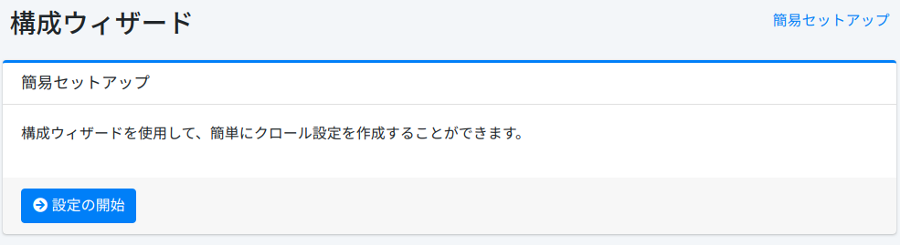
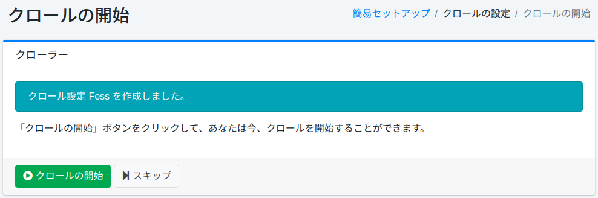

===========
配置向导
===========

概述
====

向导页面提供了一个简易设置工具,用于注册爬取配置。

简易设置
------------

此页面是用于注册爬取配置的启动页面。

|image0|

爬取配置
-----------

在此页面可以创建爬取配置。

|image1|

配置项
------

名称
::::

指定配置名称(例如:Fess网站)。

爬取路径
:::::::::

指定爬取起始 URL 或文件路径(例如:https://fess.codelibs.org/)。

最大访问数
:::::::::::

设置要爬取的页面上限。

深度
::::

设置爬取文档中包含的链接时的跟踪深度。

爬虫
------

要启动 |Fess| 爬虫,请单击"开始爬取"按钮。如果暂不爬取,请单击"跳过"按钮。

|image2|

.. |image1| image:: ../../../resources/images/ja/15.3/admin/wizard-2.png

