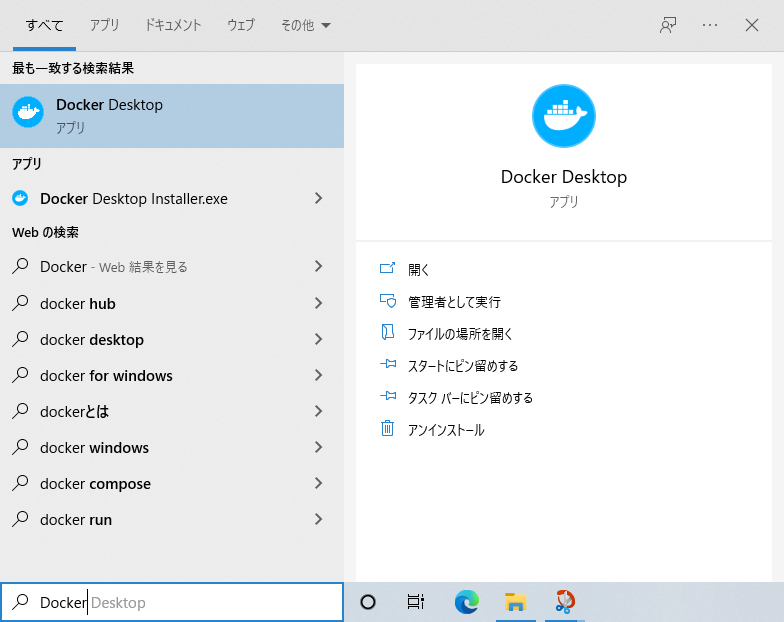

================
安装步骤
================

安装方法
================

Fess 提供 ZIP 归档、RPM/DEB 包、Docker 镜像的分发包。
使用 Docker 可以在 Windows 和 Mac 等环境中轻松设置 Fess。

构建运营环境时，请务必参考 :doc:`15.3/install/index`。

.. warning::

   **生产环境的重要注意事项**

   在生产环境或负载验证等情况下，不推荐使用内置的 OpenSearch 运行。
   请务必构建外部的 OpenSearch 服务器。

安装 Docker Desktop
============================

本文将说明在 Windows 上的使用方法。
如果未安装 Docker Desktop，请按以下步骤安装。

不同操作系统下载的文件和步骤有所不同，需要根据您的环境进行操作。
详情请参考 `Docker <https://docs.docker.com/get-docker/>`_ 的文档。

下载
------------

在 `Docker Desktop <https://www.docker.com/products/docker-desktop/>`__ 下载对应操作系统的安装程序。

运行安装程序
--------------------

双击下载的安装程序，开始安装。

确认已选中"Install required Windows components for WSL 2"或
"Install required Enable Hyper-V Windows Features"，
然后点击 OK 按钮。

|image0|

安装完成后，点击"close"按钮关闭画面。

|image1|

启动 Docker Desktop
---------------------

点击 Windows 菜单中的"Docker Desktop"启动。

|image2|

启动 Docker Desktop 后，会显示使用条款，勾选"I accept the terms"后点击"Accept"按钮。

会出现开始教程的提示，这里点击"Skip tutorial"跳过。
点击"Skip tutorial"后会显示 Dashboard。

|image3|

设置
====

为了能够将 OpenSearch 作为 Docker 容器运行，需要在操作系统端调整"vm.max_map_count"的值。
根据使用的环境设置方法有所不同，各自的设置方法请参考"` Set vm.max_map_count to at least 262144 <https://www.elastic.co/guide/en/elasticsearch/reference/current/docker.html#_set_vm_max_map_count_to_at_least_262144>`_ "。

设置 Fess
==================

创建启动文件
------------------

创建一个合适的文件夹，下载 `compose.yaml <https://raw.githubusercontent.com/codelibs/docker-fess/master/compose/compose.yaml>`_ 和 `compose-opensearch3.yaml <https://raw.githubusercontent.com/codelibs/docker-fess/master/compose/compose-opensearch3.yaml>`_。

也可以使用 curl 命令获取，如下所示：

::

    curl -o compose.yaml https://raw.githubusercontent.com/codelibs/docker-fess/master/compose/compose.yaml
    curl -o compose-opensearch3.yaml https://raw.githubusercontent.com/codelibs/docker-fess/master/compose/compose-opensearch3.yaml

启动 Fess
----------

使用 docker compose 命令启动 Fess。

打开命令提示符，移动到 compose.yaml 文件所在的文件夹，执行以下命令：

::

    docker compose -f compose.yaml -f compose-opensearch3.yaml up -d

.. note::

   启动可能需要几分钟时间。
   可以使用以下命令查看日志::

       docker compose -f compose.yaml -f compose-opensearch3.yaml logs -f

   使用 ``Ctrl+C`` 可以结束日志显示。

操作确认
========

访问 \http://localhost:8080/ 可以确认启动。

管理界面是 \http://localhost:8080/admin/。
默认管理员账户的用户名/密码为 admin/admin。

.. warning::

   **关于安全的重要注意事项**

   请务必更改默认密码。
   特别是在生产环境中，强烈建议在首次登录后立即更改密码。

管理员账户由应用服务器管理。
在 Fess 的管理界面中，将在应用服务器上通过 fess 角色认证的用户判断为管理员。

其他
======

停止 Fess
----------

要停止 Fess，在启动 Fess 的文件夹中执行以下命令：

::

    docker compose -f compose.yaml -f compose-opensearch3.yaml stop

要停止并删除容器::

    docker compose -f compose.yaml -f compose-opensearch3.yaml down

.. warning::

   使用 ``down`` 命令同时删除卷时，需要添加 ``-v`` 选项。
   在这种情况下，所有数据都会被删除，请注意::

       docker compose -f compose.yaml -f compose-opensearch3.yaml down -v

更改管理员密码
----------------------

可以在管理界面的用户编辑页面进行更改。

.. |image0| image:: ../resources/images/ja/install/dockerdesktop-1.png
.. |image1| image:: ../resources/images/ja/install/dockerdesktop-2.png

.. |image3| image:: ../resources/images/ja/install/dockerdesktop-4.png
