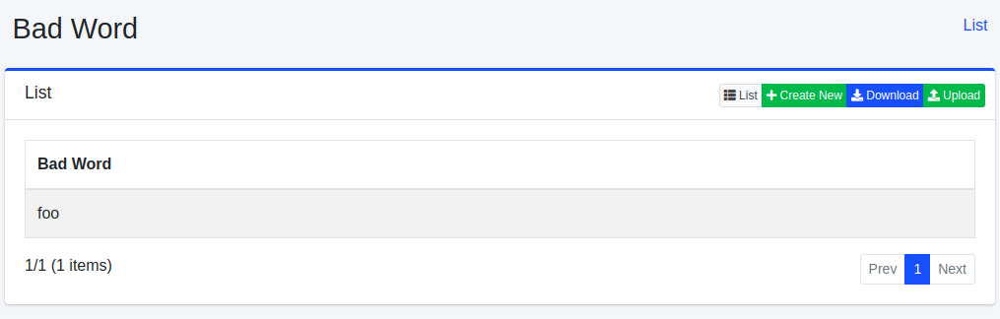
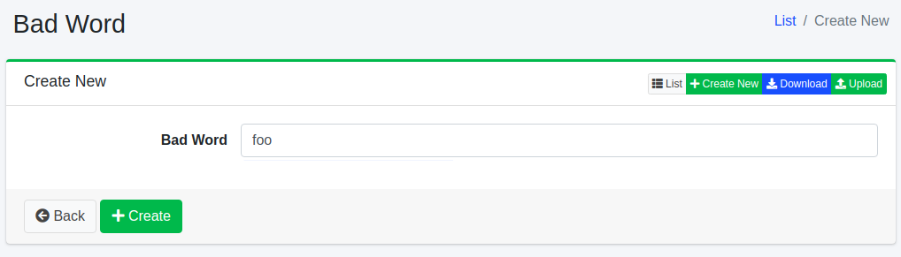
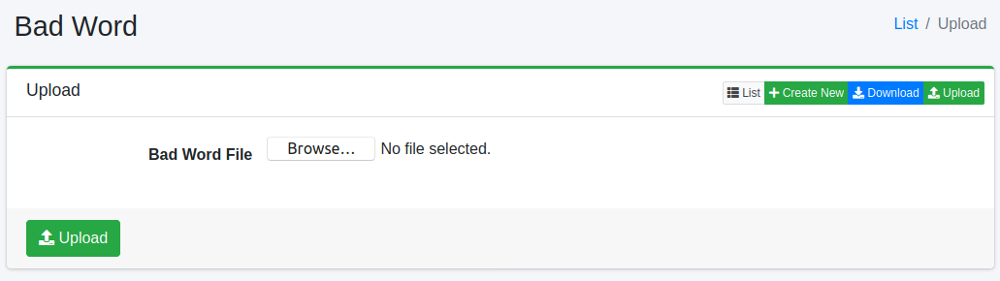

========
排除词汇
========

概述
====

本节介绍如何配置建议的排除词汇。
建议会根据搜索词显示，但您可以将某些词汇设置为不显示在建议中。

管理方法
======

显示方法
------

要打开下图所示的建议排除词汇配置列表页面，请点击左侧菜单中的 [建议 > 排除词汇]。

|image0|

要编辑配置，请点击配置名称。

创建配置
--------

要打开建议排除词汇创建页面，请点击新建按钮。

|image1|

配置项目
------

建议候选词
:::::::::::

注册禁用词汇。
在此注册的词汇将不会显示在建议中。

删除配置
--------

点击列表页面中的配置名称，然后点击删除按钮将显示确认屏幕。
点击删除按钮后，配置将被删除。

下载
=========

以CSV格式下载已注册的词汇。

|image2|

CSV内容
--------

第1行是标题行。
第2行及以后记录排除词汇。

::

"BadWord"
"检索エンジン"

上传
=========

以CSV格式注册词汇。

|image3|

CSV内容
--------

第1行是标题行。
第2行及以后描述排除词汇。

::

"BadWord"
"检索エンジン"

.. |image2| image:: ../../../resources/images/en/15.3/admin/badword-3.png

