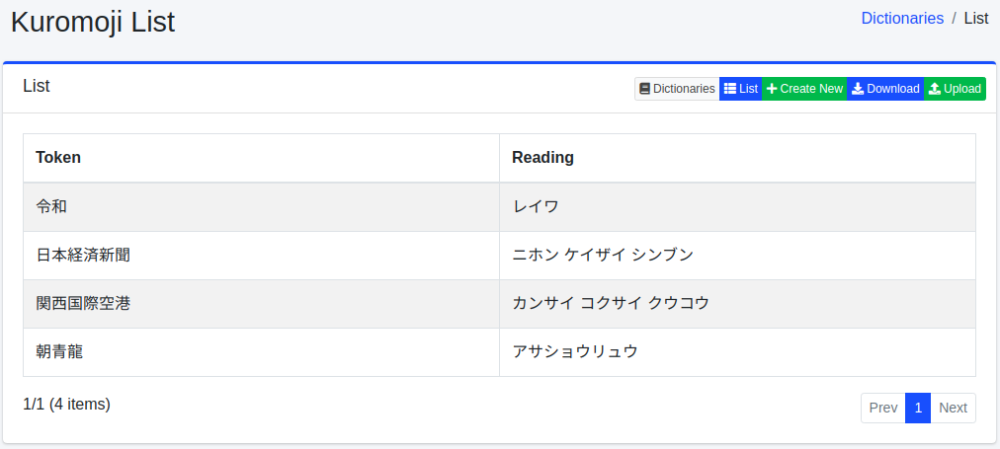
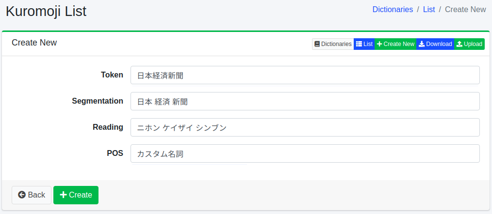

===========
Kuromoji词典
===========

概述
====

可以注册人名、专有名词、专业术语等用于形态素分析。

管理方法
======

显示方法
------

要打开下图所示的 Kuromoji 配置列表页面,请在左侧菜单中选择[系统 > 词典],然后单击 kuromoji。

|image0|

单击配置名称进行编辑。

配置方法
------

要打开 Kuromoji 配置页面,请单击"新建"按钮。

|image1|

配置项
------

标记
::::::

输入要进行形态素分析处理的单词。

分割
::::

如果单词由复合词组成,可以使分割后的单词也能被搜索到。
例如,通过将"全文检索引擎"输入为"全文 检索 引擎",可以使用分割后的单词进行搜索。

读音
::::

以片假名输入作为标记输入的单词的读音。
如果进行了分割,请分割后输入。
例如,输入"ゼンブン ケンサク エンジン"。

词性
::::

输入所输入单词的词性。

下载
=========

可以按 Kuromoji 的词典格式下载。

上传
=========

可以按 Kuromoji 的词典格式上传。
Kuromoji 的词典格式以逗号(,)分隔,格式为"标记,分割标记,分割标记的读音,词性"。
分割标记以空格分隔。
如果不需要分割,标记和分割标记将相同。
例如,如下所示。

::

    朝青龍,朝青龍,アサショウリュウ,カスタム名詞
    関西国際空港,関西 国際 空港,カンサイ コクサイ クウコウ,カスタム名詞

