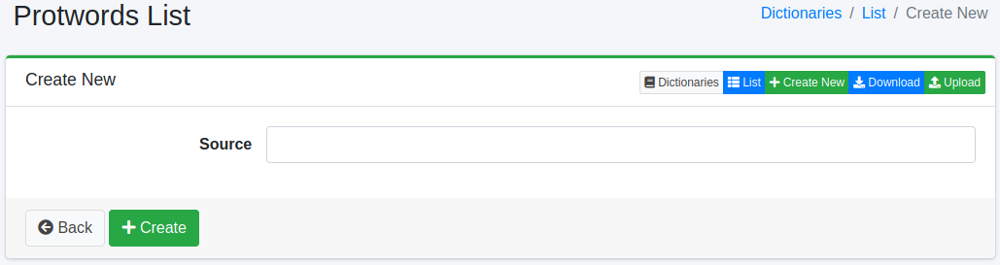

============
Protwords词典
============

概述
====

可以管理要从词干提取处理中排除的单词。
词干提取处理基本上是基于规则的处理,因此可能会发生非预期的规范化。
例如,Maine(美国州名)这个词会被规范化为 main。

管理方法
======

显示方法
------

要打开下图所示的 Protwords 配置列表页面,请在左侧菜单中选择[系统 > 词典],然后单击 protwords。

|image0|

单击配置名称进行编辑。

配置方法
------

要打开 Protwords 配置页面,请单击"新建"按钮。

|image1|

配置项
------

单词信息
::::::

输入要从词干提取处理中排除的单词。

下载
=========

可以按 Protwords 词典格式下载。

上传
=========

可以按 Protwords 词典格式上传。

.. |image0| image:: ../../../resources/images/en/15.3/admin/protwords-1.png

