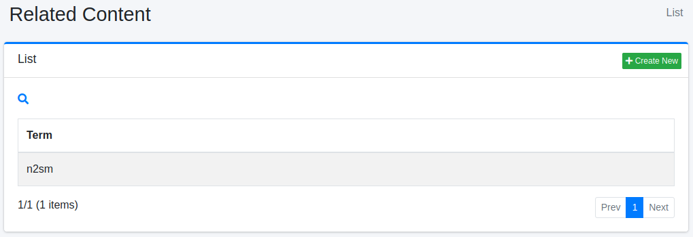

===========
相关内容
===========

概述
====

本节介绍相关内容的配置。
当搜索查询与指定的搜索词匹配时,可以在搜索结果的顶部显示相关内容。

管理方法
======

显示方法
------

要打开下图所示的相关内容配置列表页面,请点击左侧菜单中的 [爬虫 > 相关内容]。

|image0|

点击配置名称进行编辑。

创建配置
--------

要打开相关内容配置页面,请点击新建按钮。

|image1|

配置项
------

搜索词
:::::

指定要与搜索查询匹配的搜索词。

内容
::::::::

指定要在搜索结果中显示的内容。

虚拟主机
::::::::

指定虚拟主机的主机名。
详细信息请参阅 :doc:`配置指南的虚拟主机 <../config/virtual-host>`。

删除配置
--------

点击列表页面中的配置名称,然后点击删除按钮,将显示确认画面。
点击删除按钮将删除配置。

.. |image1| image:: ../../../resources/images/en/15.3/admin/relatedcontent-2.png
