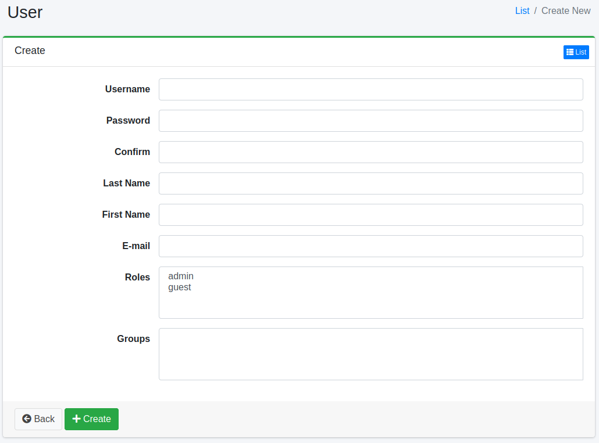

======
用户
======

概述
====

可以管理登录到 |Fess| 的用户。

管理方法
======

显示方法
------

要打开下图所示的用户设置列表页面，请点击左侧菜单中的 [用户 > 用户]。

|image0|

点击设置名称可进行编辑。

创建设置
--------

要打开用户设置页面，请点击新建按钮。

|image1|

配置项
------

用户名
::::::::

用户名。

角色
:::::

指定用户所属的角色。

组
::::::

指定用户所属的组。

删除设置
--------

点击列表页面的设置名称，然后点击删除按钮，将显示确认画面。
点击删除按钮将删除该设置。

