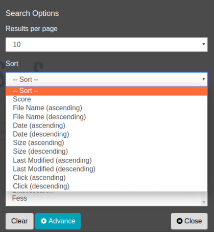

========
排序检索
========

可以指定搜索日期等字段对搜索结果进行排序。

排序对象字段
---------------

默认情况下,可以指定以下字段进行排序。

.. list-table::
   :header-rows: 1

   * - 字段名
     - 说明
   * - created
     - 爬取的日期和时间
   * - content_length
     - 爬取的文档大小
   * - last_modified
     - 爬取的文档的最后修改日期和时间
   * - filename
     - 文件名
   * - score
     - 评分值
   * - timestamp
     - 文档索引的日期和时间
   * - click_count
     - 文档的点击次数
   * - favorite_count
     - 文档的收藏次数

表: 排序对象字段列表

通过自定义,也可以添加自己的字段作为排序对象。

使用方法
------

搜索时可以选择排序条件。单击选项按钮,在显示的搜索选项对话框中可以选择排序条件。

|image0|

此外,在搜索字段中进行排序时,以"sort:字段名"的格式,用冒号(:)分隔 sort 和字段名,在搜索表单中输入并搜索。

以下以 fess 为搜索词,按文档大小升序排序。

::

    fess sort:content_length

降序排序时如下所示。

::

    fess sort:content_length.desc

按多个字段排序时,用逗号分隔指定,如下所示。

::

    fess sort:content_length.desc,last_modified

.. pdf            :width: 300 px
