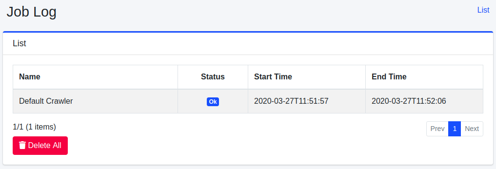
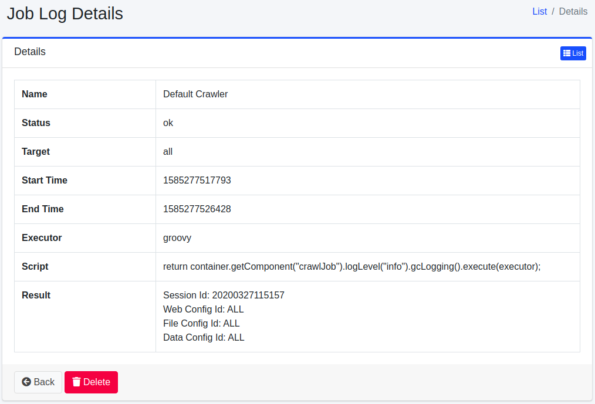

========
作业日志
========

概述
====

以列表形式显示已执行作业的结果。

管理方法
======

显示方法
------

要打开下图所示的作业日志查看页面，请点击左侧菜单中的 [系统信息 > 作业日志]。

|image0|

作业日志详情
-----------

可以查看作业的日志内容。显示作业名称、状态、开始和完成时间、结果等信息。

|image1|

名称
::::

已执行的作业名称。

状态
::::

作业的执行结果。

目标
::::

作业执行的目标。

开始时间
::::::

作业开始的UNIX时间。

结束时间
::::::

作业结束的UNIX时间。

执行方法
::::::

作业执行的运行环境。

脚本
::::::::

作业的执行内容。

结果
::::

作业的执行结果。

