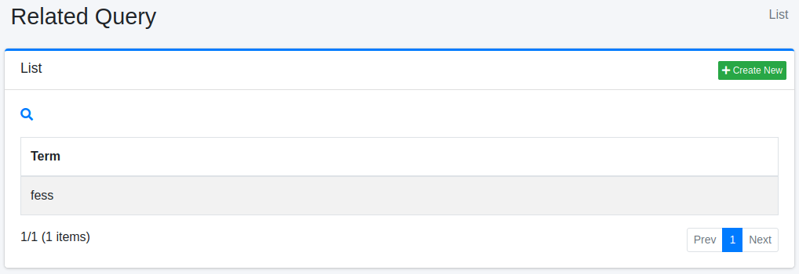
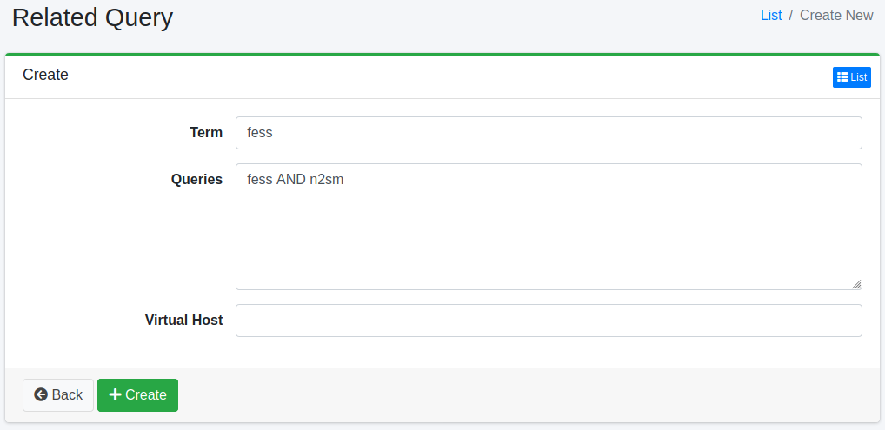

=========
相关查询
=========

概述
====

本节介绍相关查询的配置。
通过注册相关查询可以改善搜索结果。
相关查询可用作搜索词的替代词。

管理方法
======

显示方法
------

要打开下图所示的相关查询配置列表页面,请点击左侧菜单中的 [爬虫 > 相关查询]。

|image0|

点击配置名称进行编辑。

创建配置
--------

要打开相关查询配置页面,请点击新建按钮。

|image1|

配置项
------

搜索词
:::::

指定要与搜索查询匹配的搜索词。

查询
::::::

指定查询。

虚拟主机
:::::::

指定虚拟主机的主机名。
详细信息请参阅 :doc:`配置指南的虚拟主机 <../config/security-virtual-host>`。

删除配置
----------

点击列表页面中的配置名称,然后点击删除按钮,将显示确认画面。
点击删除按钮将删除配置。

从搜索日志生成
--------------

点击列表页面上的 [从搜索日志生成] 按钮，会根据最近的搜索日志创建相关查询。同一用户会话在某次搜索后短时间内接着进行的搜索（拼写错误之后的正确词，或宽泛词之后更具体的词等）被视为改写；对于经常被搜索的词，最常见的改写会成为该词的相关查询。

相关查询对所有人生效，并会扩展该词的所有搜索，因此生成会保守地进行。

- 只使用访客可见的搜索。只有当搜索日志的所有角色都满足 ``suggest.search.log.permissions`` （与建议相同的设置）时才会读取。
- 不使用包含 ``label:"x"`` 等字段指定、运算符、通配符、 ``sort:`` 、开头的 ``+`` / ``-`` 的搜索词。
- 在 [建议 > 不良词] 中登记的词既不作为搜索词，也不作为相关查询使用。
- 搜索词及其相关查询各自必须来自至少 ``related_query.generate.min.sessions`` 个会话，并且改写后的搜索必须有命中。
- 按虚拟主机分别生成。没有虚拟主机的搜索日志按默认主机处理。
- 已有相关查询的词不会被更改（结果中会显示跳过的数量）。此外，生成的数量不会超过相关查询缓存可以加载的数量（ ``page.relatedquery.max.fetch.size`` ）。

生成的相关查询可以像手动登记的一样编辑和删除。当 [系统 > 通用] 中的“搜索日志”或“用户日志”被禁用时无法生成。生成正在执行时，不能再次执行。

可以通过 ``fess_config.properties`` 中的以下设置调整生成行为。

.. list-table::
   :header-rows: 1
   :widths: 45 40 15

   * - 属性
     - 说明
     - 默认值
   * - ``related_query.generate.days``
     - 读取的搜索日志天数
     - ``30``
   * - ``related_query.generate.term.size``
     - 每个虚拟主机的搜索词最大数量
     - ``100``
   * - ``related_query.generate.query.size``
     - 每个搜索词生成的相关查询最大数量
     - ``5``
   * - ``related_query.generate.min.sessions``
     - 搜索词及其相关查询必须出现的最少会话数
     - ``3``
   * - ``related_query.generate.session.interval``
     - 视为改写的时间间隔（分钟）
     - ``10``
   * - ``related_query.generate.seed.log.size``
     - 每个搜索词读取的搜索日志最大数量
     - ``1000``
   * - ``related_query.generate.seed.session.size``
     - 每个搜索词读取的会话最大数量
     - ``200``
   * - ``related_query.generate.log.fetch.size``
     - 每个搜索词读取的后续搜索日志最大数量
     - ``2000``
   * - ``related_query.generate.query.min.length``
     - 搜索词和相关查询的最小长度（字符数）
     - ``2``
   * - ``related_query.generate.query.max.length``
     - 搜索词和相关查询的最大长度（字符数）
     - ``50``

