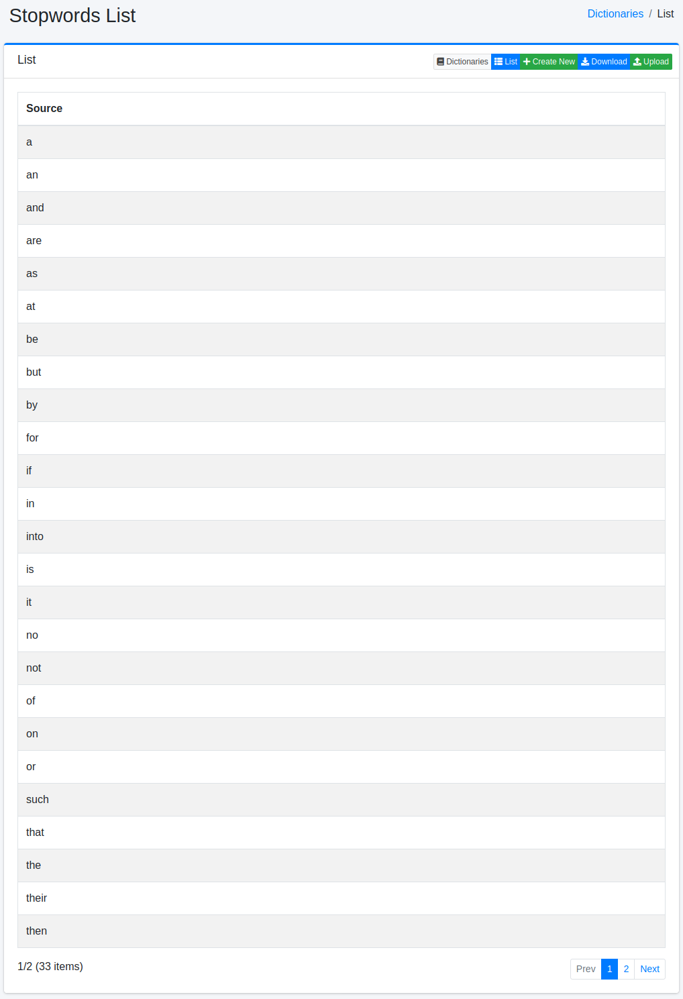
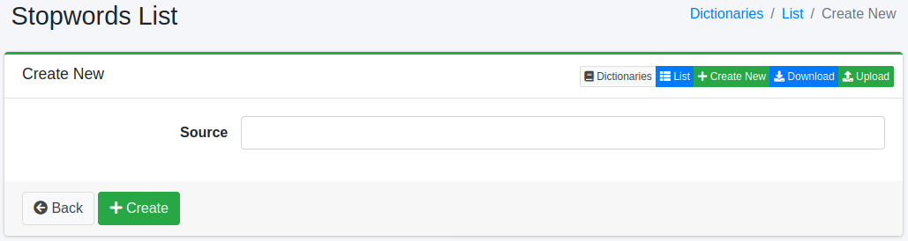

==============
停用词词典
==============

概述
====

停用词是在为文档建立索引和执行搜索时由分析器去除的词。
在停用词词典中可以管理要去除的词。

.. note::

   停用词词典是按语言划分的文件（ ``en/stopwords.txt`` 、 ``ja/stopwords.txt`` 等），
   每个文件只被对应语言的分析器使用。
   ``en/stopwords.txt`` 用于分析 ``content`` 、 ``title`` 字段以及 ``content_en`` 等 ``_en`` 字段，
   而被判定为日语的文档的 ``content_ja`` 、 ``title_ja`` 则使用 ``ja/stopwords.txt`` 进行分析。
   ``content_ja`` 等语言字段会根据请求的语言加入搜索条件，因此仅添加到 ``en/stopwords.txt`` 的词
   仍可能通过语言字段被搜索命中。
   对于不希望被搜索命中的词，请同时将其添加到目标文档语言的停用词词典中。

管理方法
======

显示方法
------

要打开下图所示的停用词配置列表页面,请在左侧菜单中选择[系统 > 字典],然后单击 stopwords。

|image0|

单击配置名称进行编辑。

配置方法
------

要打开停用词配置页面,请单击"新建"按钮。

|image1|

配置项
------

词信息
::::::

输入要作为停用词去除的词。

下载
=========

可以将停用词词典下载为每行一个词的文本文件。

上传
=========

可以上传每行一个词的文本文件。以 ``#`` 开头的行被视为注释。

