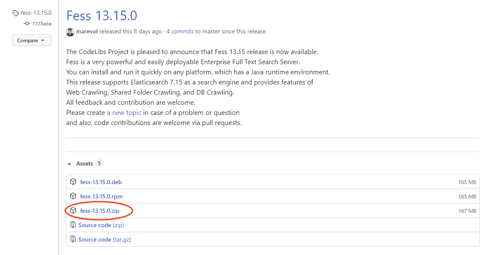
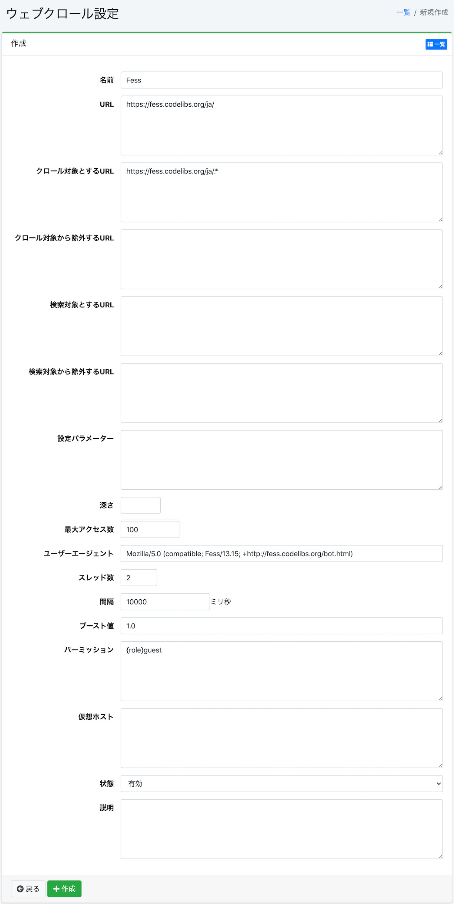

===============================================
使用Fess创建企业搜索环境 ～ 导入篇
===============================================

前言
========

需要管理的文档日益增加,如何高效管理这些文档并充分利用知识成为了一项重要需求。
管理对象文档越多,从中查找具有特定信息的文档就越困难。
解决方案之一是引入能够从海量信息中进行搜索的全文搜索服务器。

Fess 是一款易于部署的基于 Java 的开源全文搜索服务器。
Fess 的搜索引擎部分使用 Elasticsearch。
Elasticsearch 是基于 Lucene 的可扩展且设计灵活的高性能搜索引擎。
另一方面,如果要使用 Elasticsearch 构建全文搜索系统,需要自行实现爬虫等各种功能。
Fess 在爬虫部分使用 Fess Crawler,可以收集网络和文件系统上的各种类型的文档作为搜索对象。

因此,本文将介绍如何使用 Fess 构建搜索服务器。

目标读者
========

-  希望构建企业搜索/搜索系统的人员

-  希望在现有系统中添加搜索功能的人员

- 希望实现内部搜索以创建可充分利用知识的环境的人员

-  对 Lucene 或 Elasticsearch 等搜索软件感兴趣的人员

必要环境
==========

本文内容已在以下环境中进行了验证。

-  Ubuntu 22.04

-  OpenJDK 21

Fess 简介
=========

Fess 是面向网络和文件系统的开源全文搜索系统。
它由 GitHub 的 CodeLibs 项目通过 `Fess 网站 <https://fess.codelibs.org/ja/>`__\ 以 Apache 许可证提供。

Fess 的特点
-----------

基于 Java 的搜索系统
~~~~~~~~~~~~~~~~~~~~~~~~~

Fess 使用各种开源产品构建。

发行版作为可执行应用程序提供。
Fess 提供搜索界面和管理界面。
Fess 采用 LastaFlute 作为 Web 框架。
因此,如果需要自定义界面等,可以通过修改 JSP 轻松实现。
此外,配置数据和爬取数据保存在 OpenSearch 中,使用 O/R 映射器 DBFlute 访问这些数据。

Fess 是基于 Java 构建的系统,因此可以在所有支持 Java 运行的平台上执行。
它还提供了可通过 Web 浏览器轻松设置各种配置的 UI。

使用 OpenSearch 作为搜索引擎
~~~~~~~~~~~~~~~~~~~~~~~~~~~~~~~~~~~~

OpenSearch 是 AWS 提供的基于 Lucene 的开源搜索和分析引擎。
其特点包括支持实时搜索、搜索结果高亮显示和聚合功能等。
此外,可以作为搜索对象的文档数量取决于 OpenSearch 服务器的配置,可达数亿文档,是可扩展到大规模站点的搜索服务器。
在日本也有众多使用实绩,是备受关注的搜索引擎之一。

Fess 在搜索引擎部分采用了 OpenSearch。
Fess 的 Docker 版本以集成 OpenSearch 的形式发布,但也可以将其部署到与 Fess 服务器不同的服务器上使用。
此外,Fess 和 OpenSearch 都可以分别组成冗余配置,这种设计可以充分利用高扩展性。

使用 Fess Crawler 作为爬取引擎
~~~~~~~~~~~~~~~~~~~~~~~~~~~~~~~~~~~~~~~~~

Fess Crawler 是 CodeLibs 项目提供的爬虫框架。
Fess Crawler 可以巡回收集网络上的文档和文件系统上的文档。
文档收集也支持多线程同时高效处理多个文档。
此外,可处理的文档不仅包括 HTML,还包括 Word、Excel 等 MS Office 系列文件、zip 等归档文件、图像和音频文件等众多格式(对于图像和音频文件,将获取元信息)。

Fess 使用 Fess Crawler 巡回网络和文件系统上的文档,收集文本信息。
支持的文件格式也包括 Fess Crawler 可处理的所有格式。
可以从 Fess 的管理 UI 设置执行 Fess Crawler 爬取的参数等。

安装和启动
==================

这里将说明启动 Fess 并执行搜索的步骤。
虽然假设在 Ubuntu 22.04 上执行,但在 macOS 或 Windows 上也可以按照几乎相同的步骤进行安装和启动。

下载和安装
--------------------------

下载 Fess
^^^^^^^^^^^^^^^^^^^

从 https://github.com/codelibs/fess/releases 下载最新软件包。
截至本文撰写时(2025/11),最新版本为 15.3.0。
下载完成后,请解压到任意目录。

下载 Fess
|image1|

下载 OpenSearch
^^^^^^^^^^^^^^^^^^^^^^^^^

从 OpenSearch 的 `下载页面 <https://opensearch.org/downloads.html>`__\ 下载。
Fess 的下载页面会列出每个版本对应的 OpenSearch 版本,请确认版本后下载。
Fess 15.3.0 对应的版本是 3.3.0,因此下载此版本。
下载完成后,请解压到任意目录。

配置
----

启动前,需要配置 Fess 连接到 OpenSearch 集群的设置。
关于 ZIP/TAR.GZ 软件包的配置方法,请参考安装页面的 `安装方法 <https://fess.codelibs.org/ja/15.3/install/install.html>`__\ 。
如果使用的是 RPM/DEB 软件包,也请参考相同的安装页面。

启动
----

启动很简单。在解压的目录 opensearch-<version>、fess-<version> 中执行以下命令。
按 OpenSearch → Fess 的顺序启动。

启动 OpenSearch
::

    $ ./bin/opensearch

启动 Fess
::

    $ ./bin/fess

在浏览器中访问 http://localhost:8080/,如果显示以下界面,则表示启动成功。

搜索首页界面
|image2|

停止
----

要停止 Fess 服务器,需要停止(kill)Fess 进程。
停止时按 Fess → OpenSearch 的顺序停止。

目录结构
----------------

目录结构如下。

Fess 的目录结构
::

    fess-15.3.0
    ├── LICENSE
    ├── README.md
    ├── app
    │   ├── META-INF
    │   ├── WEB-INF
    │   │   ├── cachedirs
    │   │   ├── classes
    │   │   ├── conf
    │   │   ├── env
    │   │   ├── fe.tld
    │   │   ├── lib
    │   │   ├── logs
    │   │   ├── orig
    │   │   ├── plugin
    │   │   ├── project.properties
    │   │   ├── site
    │   │   ├── thumbnails
    │   │   ├── view
    │   ├── css
    │   │   ├── admin
    │   │   ├── fonts
    │   │   └── style.css
    │   ├── favicon.ico
    │   ├── images
    │   └── js
    ├── bin
    ├── extension
    ├── lib
    ├── logs
    └── temp

Fess 基于 LastaFlute 提供的 TomcatBoot 构建。
Fess 应用程序组文件位于 app 目录下。
虽然也可以从管理界面编辑,但搜索界面的 JSP 保存在 app/WEB-INF/view 下。
此外,app 目录正下方的 js、css、images 是搜索界面使用的文件。

OpenSearch 的目录结构
::

    opensearch-3.3.0
    ├── LICENSE.txt
    ├── NOTICE.txt
    ├── README.md
    ├── bin
    ├── config
    │   ├── opensearch.yml
    │   ├── jvm.options
    │   ├── jvm.options.d
    │   ├── log4j2.properties
    │   └── ...
    ├── data
    ├── lib
    ├── logs
    ├── modules
    └── plugins

索引数据保存在 data 目录中。

从索引创建到搜索
==============================

刚启动后的状态下,由于尚未创建用于搜索的索引,即使搜索也不会返回任何结果。
因此,首先需要创建索引。这里将以 https://fess.codelibs.org/ja/ 以下为对象创建索引并执行搜索的步骤为例进行说明。

登录管理页面
----------------------

首先,访问管理页面 http://localhost:8080/admin 并登录。
默认情况下,用户名和密码都是 admin。

登录管理页面
|image3|

注册爬取对象
------------------

接下来,注册爬取对象。本次以 Web 页面为对象,因此请从管理页面左侧选择【网络】。
初始状态下未注册任何内容,因此选择【新建】。

选择【新建】
|image4|

作为网络爬取的设置,本次将以 10 秒间隔用 2 个线程爬取 https://fess.codelibs.org/ja/ 以下的页面组(每 10 秒爬取约 2 个页面),并将约 100 个页面作为搜索对象。
设置项目为 URL: \https://fess.codelibs.org/ja/、作为爬取对象的 URL: \https://fess.codelibs.org/ja/.*、最大访问数: 100、线程数: 2、间隔: 10000 毫秒,其他保持默认值。

网络爬取的设置
|image5|

点击【创建】可以注册爬取对象。
可以通过点击各设置来修改注册内容。

网络爬取设置的注册完成
|image6|

开始爬取
------------------

接下来,选择 系统 > 调度器 > Default Crawler,并点击 [立即开始]。

选择调度器
|image7|

可以从 系统信息 > 爬取信息 确认爬取是否已开始以及索引是否正在创建。
如果爬取已完成,[爬取信息] 的索引大小(网络/文件)将显示作为搜索对象的文档数。

确认爬取状态
|image8|

爬取完成时的示例
|image9|

搜索执行示例
----------

爬取完成后,搜索将返回如下图所示的结果。

搜索示例
|image10|

搜索界面的自定义
======================

这里将介绍如何自定义用户最常浏览的搜索首页界面和搜索结果列表界面。

本次将展示如何更改徽标文件名的方法。
如果想更改设计本身,由于是用简单的 JSP 文件描述的,因此只要具备 HTML 知识就可以进行更改。

首先,搜索首页界面是「app/WEB-INF/view/index.jsp」文件。

搜索首页界面的 JSP 文件部分内容
::

    <la:form action="/search" method="get" styleId="searchForm">
      ${fe:facetForm()}${fe:geoForm()}
      ・
      ・
      ・
      <main class="container">
        

          

            <h1 class="mainLogo">
              " />
            </h1>
            
${notification}

            

              <la:info id="msg" message="true">
                
${msg}

              </la:info>
              <la:errors header="errors.front_header"
                footer="errors.front_footer" prefix="errors.front_prefix"
                suffix="errors.front_suffix" />
            

要更改显示在搜索首页界面上的图像,需要将上述「logo.png」部分更改为要替换的文件名。
文件应放置在「app/images」中。

<la:form> 和 <la:message> 等是 JSP 标签。
例如,<s:form> 在实际的 HTML 显示时会转换为 form 标签。
有关详细说明,请参阅 LastaFlute 网站和 JSP 相关网站。

接下来,搜索结果列表界面的页眉部分是「app/WEB-INF/view/header.jsp」文件。

页眉 JSP 文件的部分内容
::

				<la:link styleClass="navbar-brand d-inline-flex" href="/">
					"
						class="align-items-center" />
				</la:link>

要更改显示在搜索结果列表界面顶部的图像,需要更改上述「logo-head.png」部分的文件名。
与「logo.png」的情况相同,将其放置在「app/images」中。

此外,这些设置也可以从 系统 > 页面设计 进行设置。

如果要更改 JSP 文件中使用的 CSS 文件,请编辑位于「app/css」中的「style.css」。

总结
======

本文介绍了全文搜索系统 Fess 从安装到搜索以及简单的自定义方法。
我想我们已经向您展示了,无需特殊的环境构建,只要有 Java 运行环境就可以轻松构建搜索系统。
由于也可以在现有系统中添加站点搜索功能,因此请务必尝试一下。

参考资料
========

-  `Fess <https://fess.codelibs.org/ja/>`__

-  `OpenSearch <https://opensearch.org/>`__

-  `LastaFlute <https://lastaflute.dbflute.org/>`__

.. |image2| image:: ../../resources/images/ja/article/1/top.png
.. |image3| image:: ../../resources/images/ja/article/1/login.png
.. |image4| image:: ../../resources/images/ja/article/1/web-crawl-conf-1.png

.. |image6| image:: ../../resources/images/ja/article/1/web-crawl-conf-3.png
.. |image7| image:: ../../resources/images/ja/article/1/scheduler.png
.. |image8| image:: ../../resources/images/ja/article/1/session-info-1.png
.. |image9| image:: ../../resources/images/ja/article/1/session-info-2.png
.. |image10| image:: ../../resources/images/ja/article/1/search-result.png
