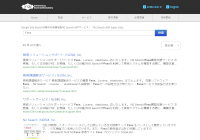

===================================
开源全文搜索服务器 Fess
===================================

概述
====

Fess 是一个"**可在5分钟内轻松构建的全文搜索服务器**"。

.. figure:: ../resources/images/en/demo-1.png
   :scale: 100%
   :alt: 标准演示
   :figclass: side-by-side
   :target: https://search.n2sm.co.jp/

   标准演示

   站内搜索演示

.. figure:: ../resources/images/en/demo-2.png
   :scale: 100%
   :alt: Code Search
   :figclass: side-by-side
   :target: https://codesearch.codelibs.org/

   源代码搜索

.. figure:: ../resources/images/en/demo-4.png
   :scale: 100%
   :alt: Document Search
   :figclass: side-by-side
   :target: https://docsearch.codelibs.org/

   文档搜索

只要有 Java 或 Docker 运行环境，就可以在任何操作系统上运行。
Fess 采用 Apache 许可证提供，可以免费使用（自由软件）。

下载
============

- :doc:`Fess 15.5.0 <downloads>` (zip/rpm/deb包)

特点
====

-  采用 Apache 许可证提供（自由软件，可免费使用）

-  可爬取 Web、文件系统、Windows 共享文件夹、数据库

-  支持 MS Office（Word/Excel/PowerPoint）和 PDF 等多种文件格式

-  操作系统独立（基于 Java 构建）

-  提供用于集成到现有站点的 JavaScript

-  使用 OpenSearch 或 Elasticsearch 作为搜索引擎

-  可搜索 BASIC/DIGEST/NTLM/FORM 认证的站点

-  可根据登录状态区分搜索结果

-  使用 ActiveDirectory 或 SAML 等进行单点登录（SSO）

-  与地图信息联动的位置信息搜索

-  可在浏览器上配置爬取目标和编辑搜索页面等

-  通过标签对搜索结果进行分类

-  添加请求头信息、重复域名设置、搜索结果路径转换

-  可通过 JSON 格式输出搜索结果与外部系统集成

-  统计搜索日志和点击日志

-  支持 Facet（分面）和 Drill-down（向下钻取）

-  自动补全和建议功能

-  用户词典和同义词词典编辑功能

-  搜索结果缓存显示功能和缩略图显示功能

-  搜索结果代理功能

-  支持智能手机（响应式网页设计）

-  通过访问令牌与外部系统集成

-  支持 OCR 等外部文本提取

-  可根据用途灵活应对的设计

新闻
========

2026-02-14
    `Fess 15.5.0 发布 <https://github.com/codelibs/fess/releases/tag/fess-15.5.0>`__

2025-12-25
    `Fess 15.4.0 发布 <https://github.com/codelibs/fess/releases/tag/fess-15.4.0>`__

2025-10-25
    `Fess 15.3.0 发布 <https://github.com/codelibs/fess/releases/tag/fess-15.3.0>`__

2025-09-04
    `Fess 15.2.0 发布 <https://github.com/codelibs/fess/releases/tag/fess-15.2.0>`__

2025-07-20
    `Fess 15.1.0 发布 <https://github.com/codelibs/fess/releases/tag/fess-15.1.0>`__

过去的新闻请查看 :doc:`这里 <news>`。

论坛
==========

如有任何问题，请访问 `论坛 <https://discuss.codelibs.org/c/FessJA/>`__。

商业支持
============

Fess 是采用 Apache 许可证提供的开源产品，个人和商业用途均可免费使用。

如需 Fess 的定制、导入、构建等支持服务，请参阅\ `商业支持（收费） <https://www.n2sm.net/products/n2search.html>`__。
此外，商业支持还提供搜索质量和爬取速度改善等性能调优服务。

- `N2 Search <https://www.n2sm.net/products/n2search.html>`__ (优化的 Fess 商业包)

- `N2 Search Super Lite <https://www.n2sm.net/services/n2search-asp-lite.html>`__ (Google Site Search 替代服务)

- :doc:`各种支持服务 <support-services>`

Fess Site Search
================

CodeLibs 项目提供 `Fess Site Search(FSS) <https://fss-generator.codelibs.org/ja/>`__。
只需在现有站点中放置 JavaScript，即可嵌入 Fess 的搜索页面。
使用 FSS 可以轻松从 Google Site Search 或 Yahoo! 搜索定制服务迁移。
如需价格实惠的 Fess 服务器，请参阅 `N2 Search Super Lite <https://www.n2sm.net/services/n2search-asp-lite.html>`__。

Data Store 插件
====================

- `Confluence/Jira <https://github.com/codelibs/fess-ds-atlassian>`__
- `Box <https://github.com/codelibs/fess-ds-box>`__
- `CSV <https://github.com/codelibs/fess-ds-csv>`__
- `Database <https://github.com/codelibs/fess-ds-db>`__
- `Dropbox <https://github.com/codelibs/fess-ds-dropbox>`__
- `Elasticsearch <https://github.com/codelibs/fess-ds-elasticsearch>`__
- `Git <https://github.com/codelibs/fess-ds-git>`__
- `Gitbucket <https://github.com/codelibs/fess-ds-gitbucket>`__
- `G Suite <https://github.com/codelibs/fess-ds-gsuite>`__
- `JSON <https://github.com/codelibs/fess-ds-json>`__
- `Office 365 <https://github.com/codelibs/fess-ds-office365>`__
- `S3 <https://github.com/codelibs/fess-ds-s3>`__
- `Salesforce <https://github.com/codelibs/fess-ds-salesforce>`__
- `SharePoint <https://github.com/codelibs/fess-ds-sharepoint>`__
- `Slack <https://github.com/codelibs/fess-ds-slack>`__

Theme 插件
===============

- `Simple <https://github.com/codelibs/fess-theme-simple>`__
- `Classic <https://github.com/codelibs/fess-theme-classic>`__

Ingester 插件
==================

- `Logger <https://github.com/codelibs/fess-ingest-logger>`__
- `NDJSON <https://github.com/codelibs/fess-ingest-ndjson>`__

Script 插件
==================

- `Groovy <https://github.com/codelibs/fess-script-groovy>`__
- `OGNL <https://github.com/codelibs/fess-script-ognl>`__

相关项目
================

- `Code Search <https://github.com/codelibs/docker-codesearch>`__
- `Document Search <https://github.com/codelibs/docker-docsearch>`__
- `Fione <https://github.com/codelibs/docker-fione>`__
- `Form Assist <https://github.com/codelibs/docker-formassist>`__

.. |image0| image:: ../resources/images/en/demo-1.png
.. |image1| image:: ../resources/images/en/demo-2.png

.. |image3| image:: ../resources/images/en/n2search_225x50.png
   :target: https://www.n2sm.net/products/n2search.html
.. |image4| image:: ../resources/images/en/n2search_b.png

.. toctree::
   :hidden:

   overview
   basic
   documentation
   tutorial
   development
   others
   archives

